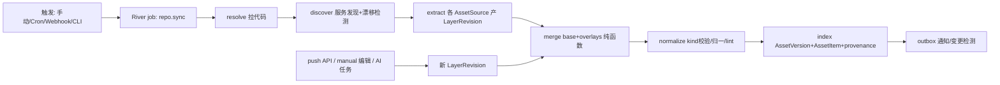
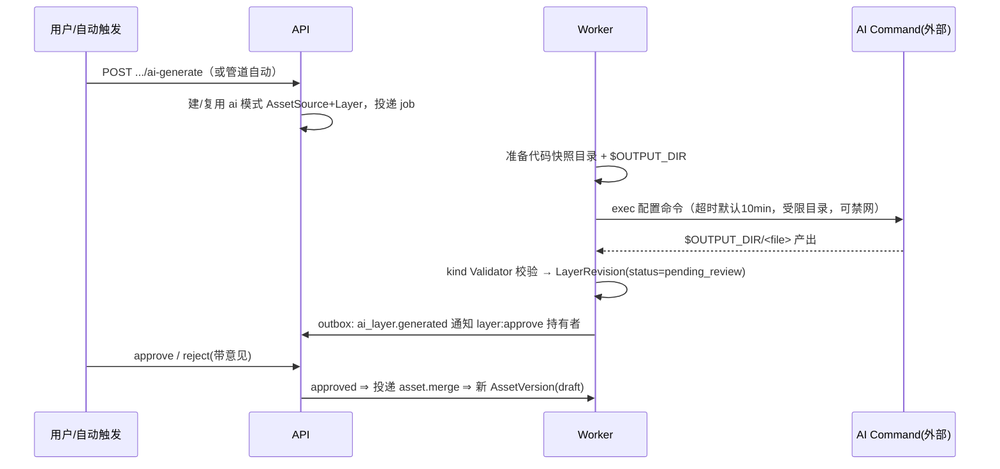

# Meridian · 后端技术设计（需求 01）

> 需求文档：[01_requirement-specification.md](./01_requirement-specification.md)
> 代码基线：**全新项目（greenfield），无现状代码**。本文档所有内容均为目标设计，凡涉及"现状"的章节均以"现状 = 空"记录，不存在 `文件:行号` 引用与数据库三方核验（标注：不适用）。
> 文档状态：目标设计（尚未实现的功能不得据此推断已上线）

## 1. 目标与设计原则

### 1.1 业务目标

把散落在 Git 仓库中的系统资产（openapi / asyncapi / dbschema / dependency 等）自动采集或经 AI 补全，经 **base + overlay 层的确定性合并** 形成带版本、可对比、可检索的资产目录，按租户强制隔离，并通过声明式视图输入契约驱动多视图门户。

### 1.2 范围边界

- 本期范围（后端）：单体 Go 服务（HTTP API + worker），PostgreSQL 存储，blob 文件存储，CLI `assetctl`。
- 外部依赖（不在本期设计范围）：
  - 前端页面（见配套前端设计文档）
  - AI 模型调用本体（平台只编排 command，见 8.2 目标契约）
  - 企微/飞书/钉钉的具体 webhook 格式适配（P1 末期）
  - Git 服务商（GitHub/GitLab/Gitee）Webhook 的差异化解析（v1 只实现通用 HMAC + GitLab/GitHub 两种头）

### 1.3 设计原则

- **Asset 是聚合根**；Layer/LayerRevision 是来源事实，AssetVersion 是呈现事实，两者分离。
- **合并是带版本号的纯函数**：相同输入（层修订清单 + 引擎版本）必得相同哈希，可重放。
- **AI 是一种 origin 不是旁路**：ai_generated 层走与 manual 层相同的修订/审批管道。
- **外部动作先落本地状态**：采集/生成任务先写 job 与 revision 骨架，再执行副作用。
- **完成/可发布状态只能派生**：AssetVersion 能否 publish 由层修订审批状态谓词推导，无手工越权通道。
- **失败默认关闭**：审批默认开启；越权一律 404；未确认契约不得靠配置强开。
- **租户隔离在最底层强制**：repo 层（数据访问层）方法签名强制携带 `tenantID`，缺失直接 panic-fail。

### 1.4 已确定的业务口径

| 事项 | 设计口径 |
| --- | --- |
| 资产身份 | 服务内 `kind + name` 唯一；name 缺省从路径/文件名推导 |
| base 层数量 | 每个资产至多 1 个 base 层；无 base 时为"空 base"占位（AI 冷启动） |
| overlay 冲突 | 后应用层覆盖先应用层（last-write-wins），覆盖记入 provenance |
| overlay 失败 | 默认 `lenient`（跳过 action 记警告）；可配 `strict` |
| overlay 方言 | openapi 兼容 OpenAPI Overlay Spec 1.0；全 kind 支持平台通用 Overlay（platform/v1）；编译到同一内部 action 模型 |
| 审批范围 | `ai_generated` 与 `third_party` 层修订默认 `pending_review`；租户可配信任模式跳过（默认关） |
| 发布策略 | base 来自 repo 且无待审 overlay ⇒ 可配自动 publish；含未审批修订 ⇒ 强制 draft |
| AI 修订 | 永不自动 publish；成功产出即 `pending_review` |
| 版本号 | 语义化自动递增：breaking→major、非破坏新增→minor、其它→patch；可手动覆盖 |
| 内容归一 | openapi 统一归一为 OAS 3.1 存储，原始文件保留 |
| 越权响应 | 404（非 403） |
| 采集并发 | 全局 worker 可配，采集类默认并发 4；单仓库工作区串行 |
| 金额/无关口径 | 不适用（本平台无资金语义） |
| 币种/时间 | 所有时间戳 UTC、RFC 3339 存取；API 出入参统一 `camelCase` |

## 2. 服务与数据边界

- **进程形态**：单二进制，两种运行模式 `serve`（HTTP + 内嵌 worker，默认）与 `worker`（纯 worker，水平扩展预留）。前端静态资源 `embed` 进二进制。
- **系统职责**：本服务负责目录、层合并、版本、diff、检索、通知编排；不负责运行时流量、AI 推理、CI 执行。
- **数据分类与写入权限**：

| 数据 | 写入方 | 说明 |
| --- | --- | --- |
| 租户/成员/凭证/仓库/服务/资产源配置 | API（人）| 权威来源 = DB；`.asset-platform.yaml` 仅经导入流程写入并打 `config_source` 标记 |
| repo 层修订 | worker（采集管道） | 只有管道能写 origin=repo 的修订 |
| manual 层修订 | API（人，`layer:edit`） | UI 编辑保存 |
| ai/third_party 层修订 | worker（ai 任务）/ push API | 初始状态 `pending_review` |
| 修订审批状态 | API（人，`layer:approve`） | 唯一状态跃迁入口 |
| AssetVersion / AssetItem / provenance | worker（merge+index 阶段） | 纯派生数据，禁止手工写 |
| 审计日志 | 中间件 + service 层 | append-only |

- **事务边界**：
  - 一次 merge 的产物（asset_versions + asset_items 批量 + 通知 outbox）在**单事务**内写入；失败整体回滚。
  - 修订审批（status 跃迁 + 触发 merge 的 job 投递）单事务（River 支持事务内入队）。
  - blob 写入（层内容文件）在事务外先行，事务内只写 `content_ref`；孤儿 blob 由清理任务回收（9.3）。

## 3. 现状基线与目标结构

### 3.1 现状基线

全新项目。无入口、无表、无可复用代码。数据库三方核验：**不适用**。

### 3.2 目标模块结构（Go 包布局）

```
cmd/
  assetd/            # 主服务（serve / worker / migrate 子命令）
  assetctl/          # CLI
internal/
  server/            # HTTP：router、middleware（auth/tenant/audit/ratelimit）
  handler/           # 按资源分包：auth、tenant、credential、repo、service、
                     # asset、layer、version、view、diff、search、job、admin
  service/           # 业务逻辑层（与 handler 一一对应 + pipeline、merge、approval）
  repo/              # 数据访问层（sqlc 生成 + 手写查询），全部方法首参 tenantID
  domain/            # 领域类型：ids、状态机、错误码
  kinds/             # AssetKind 插件：registry.go + openapi/ asyncapi/ dbschema/ dependency/
  overlay/           # 通用 overlay 引擎：dialect（oas-overlay、platform-v1）→ action 模型 → apply
  merge/             # 合并引擎（带版本号）+ provenance
  pipeline/          # 六阶段采集管道：resolve/discover/extract/merge/normalize/index
  gitx/              # git 操作封装（clone/fetch/ls-remote/worktree 快照）
  blob/              # 内容寻址存储（本地目录，接口化）
  queue/             # River 封装 + job args 定义
  notify/            # outbox 消费 → 站内/webhook/邮件 provider
  search/            # tsvector/trgm 查询构建
  viewresolve/       # ViewInputSpec 解析器
migrations/          # golang-migrate SQL
web/                 # Nuxt 4 前端（独立设计文档）
```

### 3.3 目标数据流



## 4. 业务设计

### 4.1 采集管道（repo.sync）

六阶段，每阶段独立可重试、进度落 `collection_jobs.stage`：

| 阶段 | 输入 | 输出 | 失败语义 |
| --- | --- | --- | --- |
| resolve | 仓库配置 + 凭证 | 工作区快照目录（commit 固定） | 可重试（网络类退避重试 3 次） |
| discover | 快照 + 发现规则 | 候选服务清单 / 待确认队列；`.asset-platform.yaml` 漂移检测 | 失败不阻塞后续（记警告） |
| extract | 各启用的 AssetSource | 0..N 个新 LayerRevision（content_hash 去重，未变不新建） | 单源失败不影响其它源；写 source 级错误（含 `asset_path_not_found` + 候选文件列表） |
| merge | base 修订 + 启用且 approved 的 overlay 修订（按 order） | 合并结果 + provenance | 输入未变 ⇒ 跳过；strict 失败 ⇒ 该资产本轮不产版本 |
| normalize | 合并结果 | 归一文档 + bundle + lint 报告 + 质量分 | 校验失败 ⇒ 资产标记 `invalid`，保留上一有效版本 |
| index | 归一文档 | AssetVersion + AssetItem[] + 全文索引 + diff 检测 → outbox | 单事务，失败整体重试 |

- **extract 与 push/manual/ai 的统一**：push API、manual 保存、ai 任务产出走同一个 `service.SubmitRevision(tenantID, layerID, content, meta)` 入口，之后统一投递 `asset.merge` job。管道内 extract 只是该入口的批量调用方。
- **路径未命中体验**：`file-glob` producer 在 glob 命中 0 个文件时，扫描服务根目录下所有 `*.{yaml,yml,json}`（深度 ≤ 4，上限 50 个），按文件名启发式（含 `openapi|swagger|api` 或内容嗅探 `openapi:` 头）产出候选列表写入 source 错误详情。
- **glob 展开**：命中多文件时按命名模板（默认 `{dir}` 目录名）展开为多个 Asset，各建独立 base 层；已存在同名资产则复用。

### 4.2 合并引擎（merge）

```
输入: MergeInput{ engineVer, baseRev(可空), overlays: []{layerID, rev, dialectDoc, order} }
过程: base 文档 → 逐 overlay: dialect 编译为 []Action{selector, op(merge|remove|patch), value}
      → 依序 apply → 每次写入记录 (jsonPointerPrefix → layerID)
输出: MergeOutput{ mergedDoc, mergedHash(sha256 of canonical-JSON), provenance: []{ptr, layerID}, warnings }
```

- **确定性保障**：canonical JSON（键排序、无多余空白、数字规范化）后取哈希；JSONPath 求值结果按文档序稳定排序；map 遍历一律经排序键。禁止在 merge 路径使用时间、随机数、环境变量。
- **空 base**：base 为空时以 `{}`（按 kind 提供最小骨架，openapi 为 `{"openapi":"3.1.0","info":{...},"paths":{}}`）起步，允许 AI base 层作为第一个 overlay-like 全量写入（role=base、origin=ai_generated 时直接替换骨架）。
- **引擎版本**：`merge_engine_ver` 写入 asset_versions；引擎行为变更必须升版本号，旧版本重放按旧引擎（引擎实现按版本保留在 `merge/v1/`、`merge/v2/`…）。

### 4.3 Overlay 方言编译

| 方言 | 识别 | 编译规则 |
| --- | --- | --- |
| OpenAPI Overlay 1.0 | 文档头 `overlay: "1.0.0"` | `actions[].target`(JSONPath) + `update` → op=merge；`remove: true` → op=remove |
| platform/v1 | 文档头 `overlay: "platform/v1"` + `target_kind` | `target+merge` → op=merge(RFC 7386)；`target+remove` → op=remove；`patch` → op=patch(RFC 6902，作用于整文档) |

- 保存修订时即编译校验：语法错误、`target_kind` 与资产 kind 不匹配、JSONPath 不合法 ⇒ 拒绝入库，返回 `overlay_invalid` + 行级错误。
- JSONPath 子集：支持 child、递归下降、数组下标、`[?(@.field=='v')]` 过滤；不支持脚本表达式（安全）。

### 4.4 AI 生成闭环（asset.ai_generate）



- 命令契约（8.2）：环境变量 `ASSET_KIND`、`ASSET_NAME`、`SERVICE_ROOT`、`OUTPUT_DIR`、`BASE_DOC_PATH`（已有 base 时提供，供生成 overlay）；退出码 0 且 OUTPUT_DIR 非空为成功。
- 幂等：产出 content_hash 与该层当前修订相同 ⇒ 不新建修订，job 成功返回 `unchanged`。
- 信任模式：租户设置 `ai_trust_mode=true` 时修订直接 `approved` 并触发 merge（版本仍 draft，发布仍走 F5.5 策略）。

### 4.5 Diff 与变更检测

- **入口二**：index 阶段自动 diff（新版本 vs 上一 published/latest 版本，产 breaking 标记与通知）；用户显式 diff（API/视图，`versions|collection` descriptor）。
- **执行**：kind 注册了 `Differ` 用 kind 实现（openapi = libopenapi/what-changed + 分级规则）；否则通用 diff：AssetItem 按 `key` 对齐 → added/removed；同 key 做 canonical JSON 树 diff → modified。
- **分级规则**：`breaking_rule_sets` 表，规则为 `{changeType, jsonPathPattern, level}` 列表；平台默认集 + 租户覆盖。无 kind 规则集 ⇒ diff 全部 `informational`。
- **diff 快照**：显式 diff 可 `save=true` 持久化（`diff_snapshots`），供分享链接引用。

### 4.6 视图输入解析（viewresolve）

- 输入：`input descriptor`（7.6 的 JSON）+ 目标 `viewId`。
- 校验：descriptor.mode 与 ViewDef.input.mode 匹配；kinds 交集非空；docs 数量在 min/max 内；每个引用对象做租户内存在性 + 可见性检查（不可见 ⇒ 整体 404）。
- 解析：
  - `single/versions/collection` ⇒ `DocRef[]`：`{assetVersionId, label, contentUrl(带 5min 签名), kind}`；"分支最新"解析为该分支最近成功 AssetVersion（无 ⇒ `branch_not_indexed` 错误）。
  - `scope` ⇒ `ItemQuery` 句柄：后端直接返回聚合查询结果（如 dependency 边集合、大盘统计），带分页。
- 分享链接 = `sign(descriptor + viewId + options, expiresAt)`，验签通过即以链接创建者权限的**只读子集**访问对应内容 URL。

## 5. 领域模型、状态与关键约束

### 5.1 对象关系

`Tenant 1─N Repository 1─N Service 1─N Asset 1─N Layer 1─N LayerRevision`；`Asset 1─N AssetVersion 1─N AssetItem`；`AssetSource N─1 Layer`（1:1 绑定，Source 是 Layer 的"怎么来"配置）；`SystemGroup N─M Service`。

### 5.2 状态字典

| 类型 | 值 | 含义 | 跃迁触发 |
| --- | --- | --- | --- |
| 生命周期（Service/Asset） | `draft / published / deprecated / retired` | 目录可见性与徽章 | 人工操作；仅 `draft→published→deprecated→retired` 单向 + `deprecated→published` 恢复 |
| 修订状态 | `active` | repo/manual 修订默认，参与 merge | 提交即 active |
| 修订状态 | `pending_review` | ai/third_party 修订默认，不参与 merge | 提交即 pending |
| 修订状态 | `approved` | 审批通过，参与 merge | `layer:approve` 操作 |
| 修订状态 | `rejected` | 驳回留痕，永不参与 merge | `layer:approve` 操作（带意见） |
| 修订状态 | `archived` | 被更新修订替代或层删除 | 系统 |
| 版本状态 | `draft / published / deprecated / retired` | 同生命周期 | publish 受 5.3-I3 谓词约束 |
| 采集 job 状态 | `pending / running / succeeded / failed / cancelled` | River 状态映射 + stage 细分 | worker |
| 资产健康 | `ok / invalid / stale` | normalize 失败=invalid；源连续失败≥3=stale | 管道派生 |

### 5.3 关键约束与系统不变量

- **I1** 每个资产至多一个 `role=base` 的层（DB 部分唯一索引强制）。
- **I2** 参与 merge 的修订 = base 当前修订 + 各启用 overlay 层的当前修订中 `status ∈ {active, approved}` 者；`pending_review/rejected` 绝不进入 merge 输入。
- **I3** 版本可 publish 谓词：`∀ rev ∈ layer_manifest: rev.status ∈ {active, approved}`。API 层 publish 前重查谓词，不满足返回 `version_not_publishable`。
- **I4** AssetVersion 幂等：`UNIQUE(asset_id, merged_hash, merge_engine_ver)`——输入未变不产新版本。
- **I5** 修订不可变：layer_revisions 无 UPDATE 内容路径，只允许 status 跃迁（`pending_review→approved|rejected`，其余状态不可迁）。
- **I6** 层回滚 = 移动 `current_revision_id` 指针到历史修订 + 投递 merge，不产生新修订。
- **I7** 单仓库工作区串行：River `repo.sync` 以 `repo_id` 为唯一性键（unique job），同仓库并发触发只保留一个待执行。
- **I8** 所有 repo 层方法强制 `tenant_id`；跨租户引用（如凭证挂到别租户仓库）在 service 层校验并 404。
- **I9** 采集失败与结果未知分离：git 命令超时/进程被杀（结果未知）⇒ 仅重新执行 resolve（幂等，重 clone）；extract 命令失败（明确失败）⇒ 记录 source 错误，不自动重试超过退避上限。

## 6. 数据库设计

### 6.1 变更总览

全部为新增表。PostgreSQL 16，扩展：`pg_trgm`。ID 统一 `uuid v7`（时间有序）。所有表含 `created_at timestamptz not null default now()`、`updated_at`（触发器维护），下表省略。业务表除 `tenants/users` 外均含 `tenant_id uuid not null` + 复合索引前缀，下表仅在有额外说明时列出。

| 表 | 用途 |
| --- | --- |
| tenants / users / tenant_members / service_members / api_tokens | 租户与权限 |
| credentials | Git 凭证（密文） |
| repositories / services / discovery_candidates | 仓库与服务 |
| asset_kinds / assets / asset_sources / layers / layer_revisions | 资产与层 |
| asset_versions / asset_items | 版本与条目 |
| system_groups / system_group_members | 系统分组 |
| view_defs / share_links / diff_snapshots / breaking_rule_sets | 视图与 diff |
| subscriptions / notifications / notify_outbox / breaking_todos | 订阅通知 |
| audit_logs / collection_jobs / tenant_settings | 审计、任务影子表、租户配置 |
| river_job 等 | River 自管，不手工建 |

### 6.2 格式约定

- 时间：`timestamptz`，UTC。
- 内容存储：层修订与合并产物正文存 blob（本地目录 `<dataDir>/blobs/<tenant>/<sha256[:2]>/<sha256>`），DB 只存 `content_hash`（sha256 hex）与 `content_ref`。
- JSONB 字段均给出 schema 注释；`camelCase` 键。

### 6.3 核心表 DDL（一字段一行）

#### tenants

| 字段 | 类型 | 作用 | 默认/可空 | 索引/唯一 |
| --- | --- | --- | --- | --- |
| id | uuid | 主键 | — | PK |
| slug | text | URL 标识 | not null | UNIQUE |
| display_name | text | 展示名 | not null | — |
| status | text | `active/disabled` | `active` | — |
| quota | jsonb | `{maxRepositories,maxServices,maxStorageBytes,maxCollectConcurrency}` | 平台默认 | — |
| settings | jsonb | `{aiTrustMode:bool, autoPublish:bool, defaultLocale, retention:{...}}` | `{}` | — |

#### users / tenant_members / service_members / api_tokens

| 表.字段 | 类型 | 作用 | 默认/可空 | 索引/唯一 |
| --- | --- | --- | --- | --- |
| users.id | uuid | 主键 | — | PK |
| users.username | text | 登录名 | not null | UNIQUE |
| users.password_hash | text | argon2id | not null | — |
| users.display_name / email | text | 展示/邮箱 | 可空 | — |
| users.is_platform_admin | boolean | 平台管理员 | false | — |
| tenant_members.(tenant_id,user_id) | uuid | 成员关系 | — | PK 复合 |
| tenant_members.role | text | `tenant_admin/maintainer/viewer` | not null | — |
| service_members.(tenant_id,service_id,subject_type,subject_id) | — | 服务级授权（user/team） | — | PK 复合 |
| service_members.role | text | `owner/maintainer/viewer` | not null | — |
| api_tokens.id | uuid | 主键 | — | PK |
| api_tokens.tenant_id | uuid | 归属租户；平台 bot 为空 | 可空 | idx |
| api_tokens.token_hash | text | sha256(token)，明文仅创建时返回 | not null | UNIQUE |
| api_tokens.scopes | text[] | `asset:push/asset:read/job:run/...` | not null | — |
| api_tokens.expires_at / last_used_at / revoked_at | timestamptz | 生命周期 | 可空 | — |

#### credentials

| 字段 | 类型 | 作用 | 默认/可空 | 索引/唯一 |
| --- | --- | --- | --- | --- |
| id | uuid | 主键 | — | PK |
| tenant_id | uuid | 归属；`global` 凭证为空且 `is_global=true` | 可空 | idx |
| kind | text | `ssh_key/http_token/none` | not null | — |
| name | text | 展示名 | not null | UNIQUE(tenant_id,name) |
| ciphertext | bytea | AES-256-GCM 密文（HKDF 子密钥） | not null | — |
| fingerprint | text | 指纹（掩码展示用） | not null | — |
| is_global | boolean | 平台级共享 | false | — |
| shared_scope | text | `private/team/tenant` | `private` | — |
| created_by | uuid | 创建人 | not null | — |

#### repositories / services

| 表.字段 | 类型 | 作用 | 默认/可空 | 索引/唯一 |
| --- | --- | --- | --- | --- |
| repositories.id | uuid | 主键 | — | PK |
| repositories.url | text | git 地址 | not null | UNIQUE(tenant_id,url,default_branch) |
| repositories.credential_id | uuid | 凭证 | 可空 | FK |
| repositories.default_branch | text | 默认分支 | `main` | — |
| repositories.branch_policy | jsonb | `{track:["main","release/*"],tagPrefix}` | `{}` | — |
| repositories.fetch_config | jsonb | `{shallow:bool,depth,submodules,proxy,pathAllow[],pathIgnore[]}` | `{}` | — |
| repositories.webhook_secret | text | HMAC 校验 | 可空 | — |
| repositories.sync_cron | text | 定时表达式 | 可空 | — |
| repositories.health | jsonb | `{lastSyncAt,lastCommit,lastError,failStreak,durationMs}` | `{}` | — |
| services.id | uuid | 主键 | — | PK |
| services.repository_id | uuid | 所属仓库 | not null | FK, UNIQUE(repository_id,root_dir) |
| services.slug | text | 标识 | not null | UNIQUE(tenant_id,slug) |
| services.display_name / description | text | 展示 | not null/可空 | — |
| services.root_dir | text | 仓库内根目录 | `.` | — |
| services.language / framework | text | 语言/框架 | 可空 | — |
| services.owners | jsonb | 负责人/团队/标签 | `{}` | — |
| services.lifecycle | text | 生命周期 | `draft` | idx |
| services.visibility | text | `private/internal/public` | `internal` | — |
| services.config_sync_policy | text | `ignore/import_once/sync` | `ignore` | — |
| services.deleted_at | timestamptz | 软删除 | 可空 | — |

#### asset_kinds（平台级注册表，非租户表）

| 字段 | 类型 | 作用 | 默认/可空 | 索引/唯一 |
| --- | --- | --- | --- | --- |
| id | text | `openapi/asyncapi/dbschema/...` | — | PK |
| content_format | text | `yaml-json/json/markdown` | not null | — |
| capabilities | jsonb | `{hasDiffer,hasBreakingRules,hasOverlayDialect,itemTypes[]}` | not null | — |
| enabled | boolean | 平台级开关 | true | — |

租户级启停存 `tenant_settings.disabled_kinds text[]`。

#### assets

| 字段 | 类型 | 作用 | 默认/可空 | 索引/唯一 |
| --- | --- | --- | --- | --- |
| id | uuid | 主键 | — | PK |
| tenant_id | uuid | 租户 | not null | idx |
| service_id | uuid | 所属服务 | not null | FK, **UNIQUE(service_id, kind, name)** |
| kind | text | 资产类型 | not null | FK→asset_kinds |
| name | text | 资产名 | not null | — |
| lifecycle | text | 生命周期 | `draft` | idx |
| health | text | `ok/invalid/stale` | `ok` | — |
| current_version_id | uuid | 当前发布版本指针 | 可空 | FK |
| latest_version_id | uuid | 最新版本指针 | 可空 | FK |
| quality_score | int | 0-100 lint 质量分 | 可空 | — |

#### layers

| 字段 | 类型 | 作用 | 默认/可空 | 索引/唯一 |
| --- | --- | --- | --- | --- |
| id | uuid | 主键 | — | PK |
| tenant_id / asset_id | uuid | 归属 | not null | idx / FK |
| role | text | `base/overlay` | not null | 部分唯一 `UNIQUE(asset_id) WHERE role='base'`（I1） |
| origin | text | `repo/third_party/manual/ai_generated` | not null | — |
| ord | int | overlay 应用顺序 | 0 | UNIQUE(asset_id, ord) WHERE role='overlay' |
| enabled | boolean | 启用 | true | — |
| current_revision_id | uuid | 当前修订指针（回滚=改它） | 可空 | FK |
| display_name | text | 层展示名 | 可空 | — |

#### asset_sources

| 字段 | 类型 | 作用 | 默认/可空 | 索引/唯一 |
| --- | --- | --- | --- | --- |
| id | uuid | 主键 | — | PK |
| tenant_id / service_id / asset_id | uuid | 归属 | not null | idx |
| layer_id | uuid | 绑定层（1:1） | not null | UNIQUE |
| mode | text | `builtin/command/push/manual/ai` | not null | — |
| path | text | builtin glob 路径 | 可空 | — |
| command | text | command/ai 模式命令 | 可空 | — |
| timeout_sec | int | 超时 | 120（ai 默认 600） | — |
| enabled | boolean | 启用 | true | — |
| config_source | text | `db_manual/repo_file/repo_bootstrap` | `db_manual` | — |
| last_error | jsonb | `{code,message,candidates[]}`（含 asset_path_not_found 候选） | 可空 | — |

#### layer_revisions

| 字段 | 类型 | 作用 | 默认/可空 | 索引/唯一 |
| --- | --- | --- | --- | --- |
| id | uuid | 主键 | — | PK |
| tenant_id / layer_id | uuid | 归属 | not null | idx(layer_id, created_at desc) |
| content_hash | text | sha256 | not null | UNIQUE(layer_id, content_hash) |
| content_ref | text | blob 路径 | not null | — |
| dialect | text | overlay 方言：`none/oas-overlay-1.0/platform-v1`（base 层为 none） | `none` | — |
| status | text | `active/pending_review/approved/rejected/archived` | 见 5.2 | idx(status) |
| git_commit | text | repo 层来源 commit | 可空 | — |
| created_by | uuid | manual 层操作人 | 可空 | — |
| ai_meta | jsonb | `{jobId,model,promptDigest,tokenUsage?}` | 可空 | — |
| review | jsonb | `{reviewerId,decidedAt,comment}` | 可空 | — |

#### asset_versions

| 字段 | 类型 | 作用 | 默认/可空 | 索引/唯一 |
| --- | --- | --- | --- | --- |
| id | uuid | 主键 | — | PK |
| tenant_id / asset_id | uuid | 归属 | not null | idx(asset_id, created_at desc) |
| version | text | 语义化版本（`1.4.0`），可手动指定 | not null | UNIQUE(asset_id, version) |
| status | text | `draft/published/deprecated/retired` | `draft` | idx |
| merge_engine_ver | int | 合并引擎版本 | not null | — |
| layer_manifest | jsonb | `[{layerId,revisionId,role,origin,ord}]` | not null | — |
| merged_hash | text | 合并结果哈希 | not null | **UNIQUE(asset_id, merged_hash, merge_engine_ver)**（I4） |
| merged_ref / normalized_ref / bundled_ref | text | blob：合并/归一/自包含 | not null/可空 | — |
| provenance_ref | text | blob：`[{ptr,layerId}]` | not null | — |
| source_branch / source_commit | text | 触发来源 | 可空 | idx(source_branch) |
| diff_summary | jsonb | 相对上一版本：`{added,removed,modified,breaking}` | 可空 | — |
| labels | text[] | 手动标签 | `{}` | — |

#### asset_items

| 字段 | 类型 | 作用 | 默认/可空 | 索引/唯一 |
| --- | --- | --- | --- | --- |
| id | uuid | 主键 | — | PK |
| tenant_id | uuid | 租户（检索隔离必带） | not null | 所有索引首列 |
| asset_version_id / asset_id / service_id | uuid | 反范式归属（scope 查询免 join 链） | not null | idx |
| kind / item_type | text | `openapi`/`operation`、`dbschema`/`column`… | not null | idx(tenant_id,kind,item_type) |
| key | text | 条目稳定键（如 `GET /orders/{id}`、`orders.status`） | not null | UNIQUE(asset_version_id, item_type, key) |
| display | jsonb | 视图展示字段（extractor 定义） | not null | — |
| search_text | tsvector | 全文检索 | not null | GIN |
| search_raw | text | trgm 模糊 | not null | GIN(gin_trgm_ops) |
| provenance | jsonb | `[{field,layerId,origin}]` | `[]` | — |

#### 其余支撑表（要点）

| 表 | 关键字段与约束 |
| --- | --- |
| system_groups | `id, tenant_id, parent_id(一级嵌套校验在 service 层), slug UNIQUE(tenant_id,slug), display_name` |
| system_group_members | `(group_id, service_id)` PK |
| view_defs | `id text PK, input_spec jsonb, mount text, enabled bool, ord int, options_schema jsonb`；租户覆盖存 `tenant_settings.view_overrides jsonb` |
| share_links | `id, tenant_id, token_hash UNIQUE, descriptor jsonb, view_id, options jsonb, created_by, expires_at, revoked_at` |
| diff_snapshots | `id, tenant_id, left/right(asset_version_id 或 upload blob ref), result_ref(blob), summary jsonb` |
| breaking_rule_sets | `id, tenant_id 可空(空=平台默认), kind, rules jsonb` |
| subscriptions | `id, tenant_id, user_id, target_type(service/asset/system_group/kind), target_id, events text[]`；UNIQUE(user_id,target_type,target_id) |
| notify_outbox | `id, tenant_id, event_type, payload jsonb, status(pending/sent/failed), retry_count`；index 事务内写入，消费者投递渠道 |
| breaking_todos | `id, tenant_id, asset_version_id, assignee_id, status(open/acked), acked_at, comment` |
| discovery_candidates | `id, tenant_id, repository_id, root_dir, detected jsonb, status(pending/accepted/dismissed)` |
| collection_jobs | `id, tenant_id, repository_id, river_job_id, trigger(manual/cron/webhook/api), stage, status, stage_logs jsonb, started_at, finished_at`（River 业务影子表，日志 SSE 从这读） |
| audit_logs | `id, tenant_id 可空, actor_id, actor_type(user/token), action, target_type, target_id, detail jsonb, ip`；BRIN(created_at) |
| tenant_settings | `tenant_id PK, disabled_kinds text[], view_overrides jsonb, notify_channels jsonb, breaking_overrides jsonb` |

### 6.4 历史回填与兼容

全新系统，无历史回填。预留兼容口径：`asset_items` 随版本重建（DELETE+INSERT 单事务），不做原位更新，避免 extractor 升级产生脏混合数据；extractor 升级后可对 `latest_version` 批量重建（后台任务 `asset.reindex`，可重入）。

## 7. 接口设计

> 全新系统，全部为新增接口。本章为**实现契约**：7.0 定义全局约定与全部 DTO Schema；7.1–7.7 逐端点给出职责、请求、响应、错误。任何未在 7.0.2 注册的错误码不得使用。

### 7.0 全局约定

#### 7.0.1 协议约定

| 项 | 约定 |
| --- | --- |
| 路径前缀 | 租户资源 `/api/v1/t/{tenantSlug}`（7.1–7.7 表内省略）；平台管理 `/api/v1/admin`；认证 `/api/v1/auth`；分享 `/api/v1/shared` |
| 认证方式 | 浏览器：Session Cookie `assetd_session`（HttpOnly+Secure+SameSite=Lax）+ CSRF 头 `X-CSRF-Token`（登录响应下发，仅写操作校验）。程序：`Authorization: Bearer <PAT>`（PAT 不校验 CSRF） |
| Content-Type | 请求/响应 `application/json; charset=utf-8`；文件上传 `multipart/form-data`；SSE `text/event-stream` |
| 命名 | JSON 键一律 `camelCase`；ID 为 UUID v7 字符串；时间为 RFC 3339 UTC（如 `2026-09-04T08:00:00Z`） |
| 状态码 | 成功：GET/PATCH/POST 动作=200，创建=201，DELETE=204；错误：参数/语义校验=422，冲突=409，限流=429，未认证=401，**越权与不存在一律 404**，服务端=500 |
| 分页 | 请求 `?page=1&pageSize=20`（pageSize∈[1,100]，越界钳制）；响应体 `Page<T>`（7.0.3）；排序 `?sort=field&order=asc\|desc`（各端点白名单字段） |
| 字段标记 | 本章请求 Schema 中 `!`=必填，`?`=可选；"条件必填"在字段后注明触发条件 |
| 幂等 | 所有 `POST ...:action` 动作端点可安全重放：状态已达目标时返回 200 + 当前资源（不报错），文中另有说明者除外 |
| 限流 | 登录 10 次/分/IP；写接口 60 次/分/主体；超限 429 `rate_limited`，响应头 `Retry-After` |

#### 7.0.2 错误码注册表（闭环，全量）

响应体固定为 `ErrorResponse`（7.0.3）。`details` 的结构按错误码在下表注明，无注明则为空对象。

| code | HTTP | 含义 | details 结构 |
| --- | --- | --- | --- |
| `not_found` | 404 | 不存在或无权限（统一，防存在性泄漏） | `{}` |
| `unauthorized` | 401 | 未登录 / token 无效 / 已撤销 / 过期 | `{}` |
| `csrf_failed` | 401 | CSRF 校验失败 | `{}` |
| `validation_failed` | 422 | 请求字段校验失败 | `{fields: [{path, rule, message}]}` |
| `rate_limited` | 429 | 限流 | `{retryAfterSec}` |
| `internal_error` | 500 | 未分类服务端错误（带 traceId） | `{traceId}` |
| `last_admin` | 409 | 移除/降级最后一个 tenant_admin | `{}` |
| `quota_exceeded` | 409 | 租户配额超限 | `{quotaKey, limit, current}` |
| `credential_in_use` | 409 | 凭证被仓库引用 | `{repositories: [{id, url}]}` |
| `base_layer_exists` | 409 | 资产已有 base 层（I1） | `{existingLayerId}` |
| `asset_path_not_found` | 422 | glob 未命中（extract 阶段落在 source.lastError；同步式接口直接返回） | `{scanned: int, candidates: [{path, reason}]}` |
| `overlay_invalid` | 422 | overlay 编译校验失败 | `{errors: [{line, column, message}]}` |
| `version_not_publishable` | 409 | I3 谓词不满足 | `{blockingRevisions: [{revisionId, layerId, status}]}` |
| `revision_state_invalid` | 409 | 修订状态不允许该跃迁（如 approve 一个 rejected） | `{currentStatus}` |
| `ai_command_missing` | 422 | 未配置 ai 模式命令 | `{}` |
| `ai_disabled` | 409 | AI 命令契约未冻结/平台禁用（C2 门槛） | `{}` |
| `branch_not_indexed` | 422 | descriptor 引用的分支无成功采集版本 | `{branch}` |
| `input_spec_mismatch` | 422 | descriptor 不满足视图 ViewInputSpec | `{reason: "mode"\|"kinds"\|"docCount"\|"scope"}` |
| `nesting_too_deep` | 422 | 系统分组嵌套超一级 | `{}` |
| `kind_disabled` | 409 | 资产类型被租户/平台停用 | `{kind}` |
| `unsupported_kind` | 422 | kind 未注册 | `{kind}` |
| `upload_too_large` | 422 | 上传超 10MB | `{limitBytes}` |
| `upload_expired` | 422 | uploadRef 超 2h 失效 | `{}` |
| `share_link_expired` | 404 | 分享链接过期/撤销（对外仍表现为 404） | `{}` |
| `config_import_conflict` | 409 | import-config apply 时与 db_manual 字段冲突 | `{conflicts: [{path, dbValue, fileValue}]}` |
| `job_not_cancellable` | 409 | 任务已终态 | `{status}` |

#### 7.0.3 基础与资源 DTO（Schema 权威定义）

以下 TypeScript 定义为全 API 的响应/请求结构权威（Go 侧 struct 与之一一对应，json tag 同名）。**所有端点的响应只允许引用本节类型或其字段子集。**

```ts
// ── 基础 ────────────────────────────────────────────────
interface ErrorResponse { code: string; message: string; details: object }
interface Page<T> { items: T[]; total: number; page: number; pageSize: number }
interface UserRef { id: string; username: string; displayName: string }
type Lifecycle = 'draft'|'published'|'deprecated'|'retired'
type RevisionStatus = 'active'|'pending_review'|'approved'|'rejected'|'archived'
type LayerOrigin = 'repo'|'third_party'|'manual'|'ai_generated'
type SourceMode = 'builtin'|'command'|'push'|'manual'|'ai'
type JobStatus = 'pending'|'running'|'succeeded'|'failed'|'cancelled'
type Stage = 'resolve'|'discover'|'extract'|'merge'|'normalize'|'index'

// ── 认证/租户 ───────────────────────────────────────────
interface Me { user: UserRef & { email?: string; isPlatformAdmin: boolean }
               tenants: { slug: string; displayName: string; role: 'tenant_admin'|'maintainer'|'viewer' }[]
               csrfToken: string }
interface Tenant { id: string; slug: string; displayName: string; status: 'active'|'disabled'
                   quota: TenantQuota; createdAt: string }
interface TenantQuota { maxRepositories: number; maxServices: number
                        maxStorageBytes: number; maxCollectConcurrency: number }
interface TenantSettings { aiTrustMode: boolean; autoPublish: boolean
                           disabledKinds: string[]; viewOverrides: Record<string, ViewOverride>
                           notifyChannels: NotifyChannel[]; retentionDays: { jobLogs: number; archivedRevisions: number } }
interface ViewOverride { enabled?: boolean; order?: number; defaultOptions?: object }
interface NotifyChannel { id: string; type: 'webhook'|'email'; name: string
                          config: { url?: string; secretSet?: boolean; smtpProfile?: string }; enabled: boolean }
interface ApiToken { id: string; name: string; scopes: string[]; tenantSlug: string|null
                     expiresAt: string|null; lastUsedAt: string|null; revokedAt: string|null; createdAt: string }
interface ApiTokenCreated extends ApiToken { token: string }   // 明文仅此一次

// ── 凭证/仓库/服务 ──────────────────────────────────────
interface Credential { id: string; name: string; kind: 'ssh_key'|'http_token'|'none'
                       fingerprint: string; isGlobal: boolean; sharedScope: 'private'|'team'|'tenant'
                       createdBy: UserRef; lastUsedAt: string|null; createdAt: string }
interface RepoHealth { lastSyncAt: string|null; lastCommit: string|null; lastError: string|null
                       failStreak: number; durationMs: number|null }
interface Repository { id: string; url: string; defaultBranch: string; credentialId: string|null
                       branchPolicy: { track: string[]; tagPrefix?: string }
                       fetchConfig: { shallow: boolean; depth: number; submodules: boolean
                                      proxy?: string; pathAllow: string[]; pathIgnore: string[] }
                       syncCron: string|null; note: string|null; health: RepoHealth
                       webhookUrl: string; capabilities: string[] }   // capabilities ⊂ {edit,delete,sync,discover}
interface Service { id: string; slug: string; displayName: string; description: string|null
                    repositoryId: string; rootDir: string; language: string|null; framework: string|null
                    owners: { users: UserRef[]; teams: string[]; tags: string[] }
                    lifecycle: Lifecycle; visibility: 'private'|'internal'|'public'
                    configSyncPolicy: 'ignore'|'import_once'|'sync'; drift: DriftInfo|null
                    starred: boolean; capabilities: string[] }        // ⊂ {edit,manage_sources,manage_members,delete}
interface DriftInfo { detectedAt: string; diffs: { path: string; dbValue: unknown; fileValue: unknown }[] }
interface DiscoveryCandidate { id: string; rootDir: string; status: 'pending'|'accepted'|'dismissed'
                               detected: { evidence: string; language?: string; framework?: string } }
```

```ts
// ── 资产/层/版本 ────────────────────────────────────────
interface AssetSource { id: string; assetId: string; layerId: string
                        assetKind: string; assetName: string
                        layerRole: 'base'|'overlay'; layerOrigin: LayerOrigin
                        mode: SourceMode; path: string|null; command: string|null
                        ord: number; timeoutSec: number; enabled: boolean
                        configSource: 'db_manual'|'repo_file'|'repo_bootstrap'
                        lastError: { code: string; message: string
                                     candidates?: { path: string; reason: string }[] } | null }
interface RevisionRef { id: string; status: RevisionStatus; contentHash: string; createdAt: string }
interface Layer { id: string; role: 'base'|'overlay'; origin: LayerOrigin; ord: number
                  enabled: boolean; displayName: string|null
                  currentRevision: RevisionRef|null; pendingCount: number
                  capabilities: string[] }                            // ⊂ {edit,reorder,rollback,approve}
interface LayerRevision extends RevisionRef {
  layerId: string; dialect: 'none'|'oas-overlay-1.0'|'platform-v1'
  gitCommit: string|null; createdBy: UserRef|null
  aiMeta: { jobId: string; model: string; promptDigest: string
            tokenUsage?: { prompt: number; completion: number } } | null
  review: { reviewer: UserRef; decidedAt: string; comment: string|null } | null
  contentUrl: string }                                                // 签名下载 URL，5min 有效
interface Asset { id: string; serviceId: string; kind: string; name: string
                  lifecycle: Lifecycle; health: 'ok'|'invalid'|'stale'; qualityScore: number|null
                  currentVersion: VersionRef|null; latestVersion: VersionRef|null
                  layers: Layer[]; capabilities: string[] }           // ⊂ {publish,ai_generate,edit_layers}
interface VersionRef { id: string; version: string; status: Lifecycle; createdAt: string }
interface AssetVersion extends VersionRef {
  assetId: string; mergeEngineVer: number; mergedHash: string
  layerManifest: { layerId: string; revisionId: string; role: string; origin: LayerOrigin; ord: number }[]
  sourceBranch: string|null; sourceCommit: string|null
  diffSummary: { added: number; removed: number; modified: number; breaking: number } | null
  labels: string[]
  downloads: { merged: string; normalized: string; bundled: string|null; provenance: string } } // 签名 URL
interface ProvenanceEntry { ptr: string; layerId: string; origin: LayerOrigin }
interface AssetItemRow { id: string; itemType: string; key: string
                         display: Record<string, unknown>; provenance: ProvenanceEntry[] }
```

```ts
// ── 视图/diff/检索 ──────────────────────────────────────
type InputDescriptor =
  | { mode: 'single';     assetId: string; doc: DocSel }
  | { mode: 'versions';   assetId: string; docs: DocSel[] }            // 长度受 ViewDef min/maxDocs
  | { mode: 'collection'; kind: string; docs: (DocSel & { assetId: string })[] }
  | { mode: 'scope';      scope: 'service'|'system_group'|'tenant'
      serviceId?: string; systemGroupId?: string; kinds: string[] }    // scope=service⇒serviceId!，=system_group⇒systemGroupId!
type DocSel = { versionId: string } | { branch: string } | { uploadRef: string }  // 三选一，多键并存⇒validation_failed
interface DocRef { assetVersionId: string|null; kind: string; label: string; contentUrl: string }
interface ItemQueryPage { rows: AssetItemRow[]; total: number; page: number; pageSize: number
                          aggregations?: Record<string, unknown> }     // scope 视图专用统计（按视图注明）
interface ViewDefDto { id: string; name: string; mount: 'component'|'iframe'|'external'
                       input: { mode: 'single'|'versions'|'collection'|'scope'
                                kinds: string[]|'*'; minDocs?: number; maxDocs?: number
                                scope?: string[] }
                       enabled: boolean; order: number; optionsSchema: object|null }
interface DiffChange { path: string; itemKey: string|null; type: 'added'|'removed'|'modified'
                       level: 'breaking'|'risky'|'non_breaking'|'informational'
                       before: unknown; after: unknown; byLayerId: string|null }
interface DiffResult { summary: { added: number; removed: number; modified: number; breaking: number }
                       changes: DiffChange[]; snapshotId: string|null
                       left: DocRef; right: DocRef }
interface SearchHit { scope: 'item'|'asset'|'service'|'repository'; score: number
                      highlight: string
                      item?: { itemKey: string; itemType: string; kind: string
                               assetId: string; versionId: string; serviceSlug: string }
                      asset?: { id: string; kind: string; name: string; serviceSlug: string }
                      service?: { slug: string; displayName: string }
                      repository?: { id: string; url: string } }

// ── 任务/协作 ───────────────────────────────────────────
interface JobSummary { id: string; type: string; repositoryId: string|null; assetId: string|null
                       trigger: 'manual'|'cron'|'webhook'|'api'; status: JobStatus
                       stage: Stage|null; startedAt: string|null; finishedAt: string|null; durationMs: number|null }
interface JobDetail extends JobSummary {
  stageLogs: { stage: Stage; status: JobStatus; startedAt: string; finishedAt: string|null
               error: string|null }[]
  capabilities: string[] }                                             // ⊂ {cancel}
interface Subscription { targetType: 'service'|'asset'|'system_group'|'kind'; targetId: string
                         events: string[] }   // events ⊂ 7.7 事件注册表
interface Notification { id: string; eventType: string; title: string; body: string
                         link: string|null; readAt: string|null; createdAt: string }
interface BreakingTodo { id: string; assetVersionId: string; asset: { kind: string; name: string; serviceSlug: string }
                         summary: { breaking: number }; assignee: UserRef
                         status: 'open'|'acked'; ackedAt: string|null; comment: string|null }
interface ShareLink { id: string; url: string; viewId: string; expiresAt: string; createdAt: string }
interface SystemGroup { id: string; slug: string; displayName: string; parentId: string|null
                        memberCount: number; capabilities: string[] } // ⊂ {edit,manage_members,delete}
interface AuditLog { id: string; actor: { type: 'user'|'token'; id: string; name: string }
                     action: string; targetType: string; targetId: string
                     detail: object; ip: string; createdAt: string }
```

> **capabilities 闭环规则**：每个带 `capabilities` 的 DTO，其取值全集已在类型注释中列出；前端仅凭该字段渲染操作项，后端在对应写端点做同一权限判定（双端一致的判定函数在 `internal/service/authz.go` 单点实现）。

### 7.1 认证与租户

| 接口 | 职责 | 请求 | 响应 / 特有错误 |
| --- | --- | --- | --- |
| `POST /auth/login` | 建立会话，下发 CSRF token | body `{username: string!, password: string!}` | 200 `Me` + Set-Cookie；失败 401 `unauthorized`（不区分用户不存在/密码错） |
| `POST /auth/logout` | 销毁会话 | — | 204 |
| `GET /auth/me` | 会话自省（前端启动必调） | — | 200 `Me` |
| `GET /admin/tenants` | 平台管理员列出租户 | 分页；`?status=` | 200 `Page<Tenant>` |
| `POST /admin/tenants` | 创建租户（含默认设置初始化） | body `{slug: string!(^[a-z0-9-]{2,32}$), displayName: string!, quota?: TenantQuota}` | 201 `Tenant`；slug 重复 422 `validation_failed` |
| `PATCH /admin/tenants/{slug}` | 停用/改配额 | body `{status?, quota?}` | 200 `Tenant` |
| `GET /members` | 列成员 | 分页 | 200 `Page<{user: UserRef, role: string, joinedAt: string}>` |
| `POST /members` | 加成员/改角色（upsert） | body `{userId: string!, role: 'tenant_admin'\|'maintainer'\|'viewer'!}` | 200；降级最后 admin 409 `last_admin` |
| `DELETE /members/{userId}` | 移除成员 | — | 204；409 `last_admin` |
| `GET /tokens` | 列 PAT（掩码） | 分页 | 200 `Page<ApiToken>` |
| `POST /tokens` | 创建 PAT | body `{name: string!, scopes: string[]!(⊂{asset:push,asset:read,job:run}), expiresAt?: string}` | 201 `ApiTokenCreated`（**明文仅此响应**） |
| `DELETE /tokens/{id}` | 撤销 | — | 204（幂等） |
| `GET /settings` / `PATCH /settings` | 读/改租户设置 | PATCH body = `Partial<TenantSettings>`（深合并；notifyChannels 整体替换） | 200 `TenantSettings` |

### 7.2 凭证与仓库

| 接口 | 职责 | 请求 | 响应 / 特有错误 |
| --- | --- | --- | --- |
| `GET /credentials` | 列凭证（按共享范围过滤可见性） | 分页 | 200 `Page<Credential>` |
| `POST /credentials` | 创建凭证（服务端加密后仅存密文） | body `{name: string!, kind: 'ssh_key'\|'http_token'\|'none'!, sharedScope?: ='private', sshKey?: {privateKeyPem: string, passphrase?: string}, httpToken?: {username: string, token: string}}`；**kind=ssh_key⇒sshKey 必填；kind=http_token⇒httpToken 必填**（违反 422 `validation_failed`） | 201 `Credential`（无明文回显） |
| `POST /credentials/{id}/test` | 连通性探活 | body `{repoUrl: string!}` | 200 `{ok: boolean, errorClass: 'dns'\|'auth'\|'host_key'\|'timeout'\|null, message: string}` |
| `DELETE /credentials/{id}` | 删除 | query `?force=true?` | 204；被引用且非 force 409 `credential_in_use` |
| `GET /repositories` | 列仓库 | 分页；`?q=`（url 模糊） | 200 `Page<Repository>` |
| `POST /repositories` | 录入仓库 | body `{url: string!, credentialId?: string, defaultBranch?: ='main', branchPolicy?, fetchConfig?, syncCron?: string(5 段 cron), note?: string}` | 201 `Repository`；409 `quota_exceeded`；url+branch 重复 422 `validation_failed` |
| `GET /repositories/{id}` | 详情 | — | 200 `Repository` |
| `PATCH /repositories/{id}` | 改配置 | body 同 POST 全字段可选 | 200 `Repository` |
| `DELETE /repositories/{id}` | 软删除，级联归档服务与资产 | — | 204 |
| `POST /repositories/{id}/sync` | 触发采集管道 | body `{branch?: string}`（缺省 defaultBranch） | 202 `{jobId: string, deduplicated: boolean}`（I7：排队中已有同仓库 job 时返回其 id 且 `deduplicated=true`） |
| `POST /repositories/{id}/discover` | 只跑 resolve+discover | — | 202 `{jobId}` |
| `GET /repositories/{id}/candidates` | 待确认服务清单 | `?status==pending` | 200 `Page<DiscoveryCandidate>` |
| `POST /repositories/{id}/candidates/{cid}:accept` | 候选转正为 Service | body `{slug?: string, displayName?: string}`（缺省从目录名推导） | 201 `Service` |
| `POST /repositories/{id}/candidates/{cid}:dismiss` | 忽略候选 | — | 200 `DiscoveryCandidate` |
| `POST /repositories/{id}/import-config` | 预览/应用 `.asset-platform.yaml` | query `?apply=false?`；apply=true 时 body `{resolveConflicts?: 'keep_db'\|'take_file'}` | 200 `{preview: {services: [...], sources: [...], drift: DriftInfo[]}}`；apply 冲突且未给策略 409 `config_import_conflict` |
| `POST /webhooks/git/{repoId}` | 接收 Git 推送事件（免登录） | 头 `X-Hub-Signature-256`（GitHub）或 `X-Gitlab-Token`（GitLab）；body 原文透传 | 202 `{jobId}`；验签失败/未配置 secret 404 `not_found` |

### 7.3 服务、资产源与系统分组

| 接口 | 职责 | 请求 | 响应 / 特有错误 |
| --- | --- | --- | --- |
| `GET /services` | 目录列表（分面） | 分页；`?q=&groupId=&tag=&lifecycle=&kind=&starred=&mine=`；sort ∈ {updatedAt, displayName, qualityScore} | 200 `Page<Service>` |
| `GET /services/{slug}` | 服务主页数据 | — | 200 `Service & {assets: Asset[](不含 layers 明细，layers 数组仅含统计), repository: {id, url, defaultBranch}}` |
| `PATCH /services/{slug}` | 改元信息/生命周期/可见性/同步策略 | body `{displayName?, description?, owners?, lifecycle?, visibility?, configSyncPolicy?}`；lifecycle 非法跃迁 422 `validation_failed` | 200 `Service` |
| `POST /services/{slug}:star` / `:unstar` | 收藏 | — | 200 `{starred: boolean}` |
| `DELETE /services/{slug}` | 软删除 | — | 204 |
| `GET /services/{slug}/sources` | 列资产源 | — | 200 `AssetSource[]` |
| `POST /services/{slug}/sources` | 创建源（+ 隐式创建资产与层） | body `{assetKind: string!, assetName?: string, layerRole: 'base'\|'overlay'!, layerOrigin: LayerOrigin!, mode: SourceMode!, path?: string, command?: string, ord?: number, timeoutSec?: number}`；**mode=builtin⇒path 必填；mode∈{command,ai}⇒command 必填；layerRole=overlay⇒ord 必填** | 201 `AssetSource`；409 `base_layer_exists` / `kind_disabled`；kind 未注册 422 `unsupported_kind` |
| `PATCH /sources/{id}` | 改配置/启停 | body 同 POST 全可选；改动后自动投递受影响资产 merge | 200 `AssetSource` |
| `DELETE /sources/{id}` | 删除源并归档其层与修订 | — | 204 |
| `GET /system-groups` | 分组树 | — | 200 `SystemGroup[]`（平铺，前端按 parentId 建树） |
| `POST /system-groups` | 建分组 | body `{slug!, displayName!, parentId?}` | 201 `SystemGroup`；422 `nesting_too_deep` |
| `PATCH /system-groups/{id}` / `DELETE` | 改/删（删除不动服务） | — | 200 / 204 |
| `PUT /system-groups/{id}/members` | 整体设置成员服务 | body `{serviceIds: string[]!}` | 200 `{memberCount}` |

### 7.4 资产、层与修订（核心）

| 接口 | 职责 | 请求 | 响应 / 特有错误 |
| --- | --- | --- | --- |
| `GET /assets/{id}` | 资产详情（含层结构，Viewer Shell / layers 视图数据源） | — | 200 `Asset`（layers 含完整 `Layer[]`） |
| `GET /assets/{id}/versions` | 版本列表 | 分页；`?branch=&status=` | 200 `Page<AssetVersion>`（不含 downloads，详情才给） |
| `GET /asset-versions/{vid}` | 版本详情 + 签名下载 URL | — | 200 `AssetVersion` |
| `GET /asset-versions/{vid}/provenance` | 溯源清单 | — | 200 `ProvenanceEntry[]` |
| `GET /asset-versions/{vid}/items` | 该版本条目（operations/items-table 数据源） | 分页；`?itemType=&q=`；sort ∈ {key} | 200 `Page<AssetItemRow>` |
| `POST /asset-versions/{vid}:publish` | 发布（校验 I3 谓词） | body `{version?: string}`（手动指定版本号，缺省沿用） | 200 `AssetVersion`；409 `version_not_publishable`（details.blockingRevisions） |
| `POST /asset-versions/{vid}:deprecate` / `:retire` | 生命周期推进 | — | 200 `AssetVersion` |
| `PATCH /layers/{id}` | 启停/排序/改名（任何变更自动投递 merge） | body `{enabled?: boolean, ord?: number, displayName?: string}` | 200 `Layer`；ord 冲突 422 `validation_failed` |
| `GET /layers/{id}/revisions` | 修订历史 | 分页 | 200 `Page<LayerRevision>` |
| `POST /layers/{id}/revisions` | 提交新修订（manual 编辑保存 / third_party push 的层级入口） | body `{content: string!(≤1MB), contentType: 'yaml'\|'json'!, dialect?: ='none'}`；overlay 层强制编译校验 | 201 `{revision: LayerRevision, unchanged: boolean}`（内容哈希同当前⇒`unchanged=true` 不新建）；422 `overlay_invalid` |
| `POST /layers/{id}:rollback` | 移动当前修订指针（I6，产生新版本） | body `{revisionId: string!}` | 200 `Layer`；目标修订非本层/已 rejected 409 `revision_state_invalid` |
| `POST /layer-revisions/{rid}:approve` | 审批通过（事务内投递 merge） | — | 200 `LayerRevision`；非 pending_review 409 `revision_state_invalid`（已 approved 时幂等返回 200） |
| `POST /layer-revisions/{rid}:reject` | 驳回留痕 | body `{comment: string!(1..2000)}` | 200 `LayerRevision`；409 `revision_state_invalid` |
| `GET /reviews` | 审批中心队列（跨服务聚合待审修订） | 分页；`?status==pending_review&origin=&serviceSlug=` | 200 `Page<LayerRevision & {asset: {id, kind, name, serviceSlug}}>` |
| `POST /assets/{id}/ai-generate` | 触发 AI 生成任务（无 ai 源则按默认模板自动创建） | body `{sourceId?: string, hint?: string(≤500, 透传给命令 env AI_HINT)}` | 202 `{jobId}`；422 `ai_command_missing`；409 `ai_disabled` |
| `POST /assets/preview-merge` | 编辑器实时合并预览（**无副作用，不落库**） | body `{assetId: string!, override: {layerId: string!, content: string!(≤1MB), contentType!, dialect?}}` | 200 `{mergedDoc: object, warnings: string[], provenance: ProvenanceEntry[]}`；422 `overlay_invalid`；层数>10 或 base>1MB 422 `validation_failed` |
| `POST /assets/push` | CI/外部系统推送（按业务键定位，见下方完整 Schema） | 见下 | 201 / 200 见下 |

`POST /assets/push`（PAT 作用域 `asset:push`）请求与响应完整 Schema：

```ts
interface PushRequest {
  serviceSlug: string        // ! 目标服务
  kind: string               // ! 已注册 AssetKind，否则 422 unsupported_kind
  name: string               // ! 资产名
  layerRole: 'base'|'overlay'         // ! overlay 时目标层按 origin+meta.sourceSystem 定位，无则新建
  origin: 'third_party'|'manual'      // ? 默认 third_party；repo/ai_generated 不允许经 push 写入
  createIfMissing: boolean            // ? 默认 false；资产/层不存在且 false ⇒ 404 not_found
  contentType: 'yaml'|'json'          // !
  content: string                     // ! ≤1MB
  dialect: 'none'|'oas-overlay-1.0'|'platform-v1'   // ? overlay 层默认 platform-v1
  meta: { sourceSystem: string; commit?: string }   // ! sourceSystem 用于定位/展示
}
interface PushResponse { assetId: string; layerId: string
                         revisionId: string; status: RevisionStatus   // third_party ⇒ pending_review（信任模式 approved）
                         unchanged: boolean }
```

### 7.5 Diff、上传与检索

| 接口 | 职责 | 请求 | 响应 / 特有错误 |
| --- | --- | --- | --- |
| `POST /uploads` | 临时上传（diff 本地文件场景） | multipart 字段 `file`（≤10MB） | 201 `{uploadRef: string, expiresAt: string}`；422 `upload_too_large` |
| `POST /diff` | 执行结构化 diff | body `{left: DocSel & {assetId?}, right: DocSel & {assetId?}, ruleSetId?: string, save?: boolean=false}`；`DocSel.branch` 需配 assetId；两侧 kind 不同 422 `validation_failed` | 200 `DiffResult`；422 `branch_not_indexed` / `upload_expired` |
| `GET /diff-snapshots/{id}` | 读已保存 diff | — | 200 `DiffResult` |
| `GET /search` | 全局检索 | `?q!(1..200)&scope?=item&kind=&itemType=&groupId=&hasAiLayer=&breaking=&page=&pageSize=` | 200 `Page<SearchHit>`（q 为空 422 `validation_failed`） |

### 7.6 视图解析与分享

| 接口 | 职责 | 请求 | 响应 / 特有错误 |
| --- | --- | --- | --- |
| `GET /views` | ViewDef 列表（已应用租户覆盖，按 order 排序） | `?kind=`（按 kind 过滤适配视图） | 200 `ViewDefDto[]` |
| `POST /views/resolve` | **视图输入解析器**：校验 descriptor 满足 ViewInputSpec → 解析为 docs 或 itemQuery | body `{viewId: string!, descriptor: InputDescriptor!, page?: number, pageSize?: number}`（分页仅 scope 模式生效） | 200 `{docs: DocRef[]} \| {itemQuery: ItemQueryPage}`（二选一，按视图 mode 确定）；422 `input_spec_mismatch` / `branch_not_indexed` |
| `POST /share-links` | 生成签名分享链接 | body `{descriptor!, viewId!, options?: object, expiresInSec: number!(300..2592000)}` | 201 `ShareLink` |
| `GET /share-links` / `DELETE /share-links/{id}` | 管理本人分享链接 | 分页 / — | 200 `Page<ShareLink>` / 204 |
| `GET /shared/{token}` | 匿名访问分享内容（免登录，无租户前缀） | — | 200 `{view: ViewDefDto, options: object, resolved: {docs?} \| {itemQuery?}, theme: 'light'}`；过期/撤销 404 |

**resolve 的 scope 模式响应约定（闭环）**：`dep-graph` 的 `itemQuery.rows[].display = {fromServiceId, toServiceId|external, protocol, middleware?}`，`aggregations = {nodes: [{serviceId, slug, displayName, groupId}]}`；`catalog-dashboard` 的 `aggregations = {serviceCount, assetCount, itemCount, qualityHistogram: number[10], coverage: [{kind, withCount, withoutServices: [{slug}]}]}`。其它 scope 视图新增时必须在 ViewDef 注册文档中同样写明 rows/aggregations 结构。

### 7.7 任务、订阅、通知、审计

事件类型注册表（订阅 events 与 outbox 的闭环全集）：`version.published`、`version.breaking`、`collect.failed`、`service.deprecated`、`ai_layer.generated`、`layer.approved`、`layer.rejected`。

| 接口 | 职责 | 请求 | 响应 / 特有错误 |
| --- | --- | --- | --- |
| `GET /jobs` | 任务列表 | 分页；`?type=&status=&repositoryId=` | 200 `Page<JobSummary>` |
| `GET /jobs/{id}` | 任务详情 | — | 200 `JobDetail` |
| `GET /jobs/{id}/logs` | 日志流 | SSE；事件 `log: {stage, line, ts}`、`stage: {stage, status}`、`done: {status}`；`Last-Event-ID` 支持断点续传 | 终态任务直接回放全量后 `done` |
| `POST /jobs/{id}:cancel` | 取消排队/运行中任务 | — | 200 `JobSummary`；终态 409 `job_not_cancellable` |
| `GET /subscriptions` | 我的订阅 | — | 200 `Subscription[]` |
| `PUT /subscriptions` | upsert 一条订阅（events 为空数组=取消） | body `Subscription!`（events ⊂ 上方注册表，否则 422） | 200 `Subscription` |
| `GET /notifications` | 站内信 | 分页；`?unread=true?` | 200 `Page<Notification>` + 响应头 `X-Unread-Count` |
| `POST /notifications/{id}:read` / `POST /notifications:read-all` | 已读 | — | 204 |
| `GET /breaking-todos` | breaking 待办 | 分页；`?status=` | 200 `Page<BreakingTodo>` |
| `POST /breaking-todos/{id}:ack` | 确认知悉 | body `{comment?: string(≤2000)}` | 200 `BreakingTodo` |
| `GET /audit-logs` | 审计查询 | 分页；`?actorId=&action=&targetType=&from=&to=` | 200 `Page<AuditLog>` |
| `GET /admin/jobs` / `GET /admin/audit-logs` | 平台管理员跨租户视角 | 同上 + `?tenantSlug=` | 同上 |

## 8. 依赖接口与集成约束

### 8.1 已核验依赖（库/系统级）

| 依赖 | 用途 | 接入注意事项 |
| --- | --- | --- |
| PostgreSQL 16 + pg_trgm | 存储/检索/队列 | 连接池 pgx；tsvector 用 `simple` 配置 + 应用侧分词（中英混合，避免依赖 zhparser 扩展） |
| River (riverqueue) | 任务队列 | 事务内入队；unique job 以 `repo_id` 保证单仓库串行（I7） |
| go-git + 系统 git 回退 | 仓库操作 | shallow clone 优先；SSH known_hosts 按 F2.5；命令超时 kill 进程组 |
| libopenapi / libopenapi-validator / what-changed | openapi 解析/校验/diff | swagger2→3.1 归一经 libopenapi 转换；bundle 用其解析树内联 `$ref` |
| ojg（JSONPath） | overlay target 求值 | 禁用脚本表达式；结果按文档序排序保证确定性（4.2） |
| golang-migrate | 迁移 | 版本化可回滚 |

### 8.2 目标契约（尚未落地，待外部提供/联调）

| 目标契约 | 本方案假设的能力 | 阻塞项 |
| --- | --- | --- |
| AI 生成命令契约 | 外部命令读 `SERVICE_ROOT/ASSET_KIND/ASSET_NAME/BASE_DOC_PATH/OUTPUT_DIR` 环境变量，产出合法资产文件，退出码语义 0=成功 | **C2**：`assetctl ai-gen` 参考实现需先冻结此契约；未冻结前 `ai` 模式仅接口就位，不开放给租户 |
| 通知渠道 webhook 格式 | 企微/飞书/钉钉各自 payload 模板 | C4：v1 先做通用 JSON webhook，IM 专用模板待确认 |
| dbschema / dependency 内容 JSON Schema | `atlas inspect` 输出映射为平台 dbschema JSON；dependency 边 JSON | **C3**：两个 kind 的 content schema 需在 M4 开工前评审冻结（影响 extractor/DDL 无关，仅影响 kind 插件） |
| OIDC/LDAP | `AuthProvider` 接口（`Authenticate/Lookup`） | 非阻塞，v1 只有 local |

> 目标契约未冻结前，对应功能不得通过配置强行开放；错误码不得随文案变化。

## 9. 定时任务与失败恢复

| 任务 | 类型 | 触发 | 作用 | 幂等/锁 |
| --- | --- | --- | --- | --- |
| `repo.sync` | River job | 手动/API/Webhook/每仓库 `sync_cron`（River periodic，读 DB 配置） | 六阶段管道 | unique(repo_id)；工作区目录锁 |
| `asset.merge` | River job | 修订变化/层配置变化/审批通过 | 单资产 merge+normalize+index | unique(asset_id) 去抖；I4 哈希幂等 |
| `asset.ai_generate` | River job | API/管道自动 | 4.4 流程 | content_hash 幂等；超时 kill，结果未知时**只查 OUTPUT_DIR 不重放命令**（有产出则入库，无产出记 failed） |
| `asset.reindex` | River job | extractor 升级后手动 | 重建 latest 版本条目 | 分页 + 可重入 |
| `outbox.dispatch` | River periodic 30s | — | 投递通知，指数退避 ≤ 5 次 | 行级 `FOR UPDATE SKIP LOCKED` |
| `workspace.gc` | River periodic 1h | — | clone 缓存 LRU + 租户磁盘配额 | 目录锁 |
| `blob.gc` | River periodic 24h | — | 回收无引用 blob（孤儿，创建 > 48h） | 引用计数查询 + 宽限期 |
| `retention.cleanup` | River periodic 24h | — | 任务日志/归档修订按租户保留策略清理 | 幂等 DELETE |
| `pg.backup` | 部署层（compose 内 sidecar cron） | 每日 | `pg_dump` + 保留策略 | 不在应用内实现 |

**失败 vs 结果未知**（I9）：明确失败（非零退出、校验失败）⇒ 记录错误、按退避重试至上限、不产生半成品数据；结果未知（超时/进程丢失）⇒ 只做"查询式恢复"（检查产出/工作区状态），绝不盲目重放有副作用的外部命令。

## 10. 实施路径

### 10.1 模块实施顺序（对应需求里程碑）

| 阶段 | 交付 | 关键文件/包 |
| --- | --- | --- |
| M0 地基（2-3 周） | migrations 全量核心表；auth/tenant/member/token handler；credential（加密）；repository CRUD + sync 触发；River 接入；audit 中间件；kinds registry 骨架 | `internal/{server,handler,repo}`、`migrations/0001~0009` |
| M1 主链路（3-4 周） | pipeline 六阶段（merge 恒等）；openapi kind（Validator/ItemExtractor）；file-glob producer；asset/version/item API；views/resolve（single）；blob 存储 | `internal/{pipeline,kinds/openapi,merge,blob,viewresolve}` |
| M2 层与 Overlay（3 周） | overlay 引擎双方言；layers/revisions/rollback API；preview-merge；provenance；manual 层 | `internal/overlay`、`merge/v1` 完整化 |
| M3 AI + Diff（3 周） | ai_generate job + 审批 API + 状态机；openapi differ + breaking 规则集；diff API/快照；`assetctl`（push/diff/ai-gen） | `internal/{service/approval,kinds/openapi/differ}`、`cmd/assetctl` |
| M4 多 kind + 全局（3-4 周） | dbschema/dependency kind；system-groups；scope 解析（dep-graph/dashboard 查询）；search | `internal/{kinds/dbschema,kinds/dependency,search}` |
| M5 协作开放（3 周） | subscriptions/outbox/渠道 provider；breaking todos；分享链接；webhook 出向 | `internal/notify` |

### 10.2 配置（env）

`DATABASE_URL`、`MASTER_KEY`（32B base64，启动校验）、`DATA_DIR`（blobs+workspaces）、`BASE_URL`（签名 URL/分享链接）、`WORKER_CONCURRENCY`（默认 8）、`COLLECT_CONCURRENCY`（默认 4）、`SESSION_SECRET`、`HTTP_PROXY` 透传、`AI_EXEC_NETWORK`（`inherit/none`，默认 inherit）。

## 11. 测试与验收

| 场景 | 条件 | 预期 |
| --- | --- | --- |
| 租户越权（每资源必测） | A 租户 token 访问 B 租户任意资源 ID | 404 `not_found`，无存在性泄漏 |
| 合并确定性 | 固定 3 层（repo+manual+manual）输入重放 100 次 | merged_hash 全一致 |
| provenance 正确性 | overlay 覆盖 base 同一字段 | 该 ptr 归属为 overlay 层 |
| 版本幂等 | 同内容重复采集 | 不产生新 AssetVersion（I4） |
| 审批门禁 | 含 pending_review 修订的版本 publish | 409 `version_not_publishable` |
| pending 不参与合并 | AI 修订 pending 时触发 merge | 合并输入不含该修订（I2） |
| 并发采集 | 同仓库连发 5 次 sync | 仅 1 个 job 执行（I7 dedup） |
| AI 结果未知 | 命令超时被 kill | 检查 OUTPUT_DIR：有合法产出则入库，否则 failed；不重放 |
| glob 未命中 | path 配错 | `asset_path_not_found` + 候选列表非空 |
| overlay 非法 | target_kind 不匹配 | 422 `overlay_invalid`，未入库 |
| 分支 doc 解析 | descriptor 引用未采集分支 | 422 `branch_not_indexed` |
| 分享链接 | 过期/撤销 token | 404 |

验收基线：需求 4 章非功能指标（merge P95<200ms@1MB+10层、检索<500ms@50万条目、目录页<300ms）在 CI 基准测试中守护。

## 12. 发布、回滚与上线门槛 / 待确认契约

- 发布：docker-compose（app + postgres + backup sidecar）；迁移 `assetd migrate up` 独立步骤先行；回滚 = 镜像回退 + `migrate down`（所有迁移必须提供 down）。
- 上线门槛：11 章越权/确定性/审批门禁用例全绿；示例租户一键体验脚本可跑通（5 分钟出首个文档）。

| 编号 | 级别 | 待确认项 | 未确认影响 |
| --- | --- | --- | --- |
| C1 | P0 | 通用 Overlay 的 JSONPath 子集边界（是否需要 `[*]` 通配写入语义） | 影响 overlay 引擎实现与文档；M2 开工前冻结 |
| C2 | P0 | AI 命令契约（环境变量/退出码/多文件产出） | 未冻结前 `ai` 模式不开放（8.2） |
| C3 | P1 | dbschema/dependency 内容 JSON Schema | 阻塞 M4 两个 kind 插件 |
| C4 | P2 | IM 渠道（企微/飞书/钉钉）消息模板 | 只影响通知美观度，走通用 webhook 兜底 |
| C5 | P1 | 质量分算法（lint 规则→分值映射） | 未定前 quality_score 置空不展示 |

## 13. 专业名词表

| 统一名称 | 英文/代码标识 | 一句话口径 |
| --- | --- | --- |
| 层 / 层修订 | `Layer` / `LayerRevision` | 层是资产的一个来源槽位；修订是层内容的不可变快照，回滚只移指针 |
| 合并清单 | `layer_manifest` | AssetVersion 记录的参与合并的 {层→修订} 集合，重放合并的输入凭证 |
| 溯源 | `provenance` | 合并结果中 JSON Pointer → 最后写入层 的映射 |
| 输入描述符 | `input descriptor` | 前端/分享链接携带的视图输入 JSON，经 `views/resolve` 校验解析 |
| 空 base | empty base | 资产无 base 源时的骨架占位，AI 冷启动起点 |
| 结果未知 | unknown outcome | 外部命令超时/进程丢失；只允许查询式恢复，禁止重放 |
| 信任模式 | `aiTrustMode` | 租户级开关：AI/第三方修订跳过审批直接 approved（默认关） |
| 去抖合并 | merge dedup | 同资产 merge job 以 unique(asset_id) 合并排队请求 |

---

## 附录 B · API 全局约定（可直接编码）

### B.1 通用规则

| 项 | 约定 |
| --- | --- |
| Base URL | 租户资源 `/api/v1/t/{tenantSlug}`；平台 `/api/v1/admin`；认证 `/api/v1/auth`；匿名分享 `/api/v1/shared` |
| 认证 | 浏览器：`Set-Cookie: sid=...; HttpOnly; SameSite=Lax` + CSRF 头 `X-CSRF-Token`（`GET /auth/csrf` 获取，仅非 GET 必带）；程序：`Authorization: Bearer pat_<token>`（PAT 免 CSRF） |
| Content-Type | 请求/响应 `application/json; charset=utf-8`；上传 `multipart/form-data`；SSE `text/event-stream` |
| 命名 | JSON 键一律 `camelCase`；枚举值 `snake_case` 字符串（与 DB 一致） |
| 时间 | RFC 3339 UTC，如 `2026-09-04T08:00:00Z` |
| ID | uuid v7 字符串；路径中的 `{tenantSlug}`、`{serviceSlug}` 为 slug，其余为 uuid |
| 分页 | 请求 `?page=1&pageSize=20`（pageSize max 100，越界钳制不报错）；响应 `{"items":[],"total":0,"page":1,"pageSize":20}` |
| 排序 | `?sort=createdAt:desc,name:asc`；字段白名单由各端点声明，非法字段 422 |
| 过滤 | 平铺 query 参数（见各端点）；多值用重复参数 `?tag=a&tag=b` |
| 幂等 | 写操作支持可选 `Idempotency-Key` 头（uuid），服务端 24h 去重返回首次结果 |
| 动作端点 | 冒号后缀 `POST .../{id}:publish`；动作请求体可为空 `{}` |
| 版本兼容 | 响应新增字段不算破坏；删除/改名走 `/api/v2`；`Deprecation` 头预告 |
| 限流 | 按 token/会话 600 req/min；超限 429 + `Retry-After` 头 |
| 请求追踪 | 响应带 `X-Trace-Id`；日志以此关联 |

### B.2 错误响应与错误码注册表

统一信封（HTTP 状态 + 业务码双轨）：

```json
{ "code": "overlay_invalid", "message": "人类可读（跟随 Accept-Language）",
  "traceId": "…", "details": { } }
```

| code | HTTP | details 结构 | 触发场景 |
| --- | --- | --- | --- |
| `unauthorized` | 401 | — | 未登录/token 无效或过期 |
| `not_found` | 404 | — | 不存在**或无权**（统一，防存在性泄漏）；含 scope 不足的 PAT |
| `validation_error` | 422 | `{fields:[{path,rule,message}]}` | 通用参数校验失败 |
| `asset_path_not_found` | 422 | `{configuredPath, candidates:[{path,reason}]}` | builtin glob 零命中 |
| `overlay_invalid` | 422 | `{errors:[{line,col,message}]}` | overlay 编译/方言校验失败 |
| `input_spec_mismatch` | 422 | `{expected:{mode,kinds,minDocs,maxDocs}, got:{...}}` | descriptor 与 ViewDef 不匹配 |
| `branch_not_indexed` | 422 | `{branch}` | 分支无成功采集版本 |
| `nesting_too_deep` | 422 | — | 分组嵌套超一级 |
| `ai_command_missing` | 422 | — | ai 源未配置命令 |
| `version_not_publishable` | 409 | `{blockingRevisions:[{revisionId,layerId,status}]}` | I3 谓词不满足 |
| `base_layer_exists` | 409 | `{existingLayerId}` | 违反 I1 |
| `quota_exceeded` | 409 | `{quota, used, limit}` | 配额超限 |
| `last_admin` | 409 | — | 移除最后 tenant_admin |
| `credential_in_use` | 409 | `{repositories:[{id,url}]}` | 删除被引用凭证 |
| `conflict` | 409 | `{reason}` | 通用并发冲突（乐观锁 updatedAt 不匹配） |
| `rate_limited` | 429 | `{retryAfterSec}` | 限流 |
| `payload_too_large` | 413 | `{limitBytes}` | 上传/内容超限 |
| `internal_error` | 500 | — | 兜底；message 不含内部细节 |

> 新增错误码必须先登记本表再使用；code 字符串冻结，不随文案变化。

## 附录 C · DTO Schema（权威类型定义）

> TypeScript 记法，后端 Go struct 与此一一对应（json tag 相同）；`?` = 可空/可缺省。前端由后端 OpenAPI 自描述生成，本表为评审基准。

```ts
// ---------- 通用 ----------
interface Page<T> { items: T[]; total: number; page: number; pageSize: number }
interface ErrorResponse { code: string; message: string; traceId: string; details?: object }
type Lifecycle = 'draft'|'published'|'deprecated'|'retired'
type Origin = 'repo'|'third_party'|'manual'|'ai_generated'
type RevisionStatus = 'active'|'pending_review'|'approved'|'rejected'|'archived'
type SourceMode = 'builtin'|'command'|'push'|'manual'|'ai'

// ---------- 认证/租户 ----------
interface MeResponse { user: UserDTO; tenants: {slug:string; displayName:string; role:'tenant_admin'|'maintainer'|'viewer'}[]; isPlatformAdmin: boolean }
interface UserDTO { id:string; username:string; displayName?:string; email?:string }
interface TenantDTO { id:string; slug:string; displayName:string; status:'active'|'disabled'; quota:QuotaDTO; createdAt:string }
interface QuotaDTO { maxRepositories:number; maxServices:number; maxStorageBytes:number; maxCollectConcurrency:number }
interface TenantSettingsDTO { aiTrustMode:boolean; autoPublish:boolean; disabledKinds:string[]; viewOverrides?:object; notifyChannels?:NotifyChannelDTO[]; retention?:{jobLogDays:number; archivedRevisionDays:number} }
interface TokenDTO { id:string; name:string; scopes:string[]; expiresAt?:string; lastUsedAt?:string; revokedAt?:string; createdAt:string }
interface TokenCreatedDTO extends TokenDTO { token: string }   // 明文仅此响应出现

// ---------- 凭证/仓库/服务 ----------
interface CredentialDTO { id:string; name:string; kind:'ssh_key'|'http_token'|'none'; fingerprint:string; sharedScope:'private'|'team'|'tenant'; isGlobal:boolean; createdBy:string; lastUsedAt?:string }
interface RepositoryDTO { id:string; url:string; credentialId?:string; defaultBranch:string;
  branchPolicy:{track:string[]; tagPrefix?:string}; fetchConfig:FetchConfigDTO; syncCron?:string;
  health:RepoHealthDTO; note?:string; createdAt:string; capabilities:string[] }
interface FetchConfigDTO { shallow:boolean; depth?:number; submodules:boolean; proxy?:string; pathAllow:string[]; pathIgnore:string[] }
interface RepoHealthDTO { lastSyncAt?:string; lastCommit?:string; lastError?:string; failStreak:number; durationMs?:number }
interface CandidateDTO { id:string; rootDir:string; detected:{by:string; language?:string; framework?:string}; status:'pending'|'accepted'|'dismissed' }
interface ServiceDTO { id:string; slug:string; displayName:string; description?:string; repositoryId:string; rootDir:string;
  language?:string; framework?:string; owners:{users:string[]; teams:string[]; tags:string[]};
  lifecycle:Lifecycle; visibility:'private'|'internal'|'public'; configSyncPolicy:'ignore'|'import_once'|'sync';
  drift?:{fields:{path:string; dbValue:unknown; repoValue:unknown}[]};
  assets:AssetSummaryDTO[]; capabilities:string[] }

// ---------- 资产/层/版本 ----------
interface AssetSummaryDTO { id:string; kind:string; name:string; lifecycle:Lifecycle; health:'ok'|'invalid'|'stale';
  qualityScore?:number; currentVersion?:VersionRefDTO; latestVersion?:VersionRefDTO;
  layerBadges:{origin:Origin; pendingCount:number}[] }
interface VersionRefDTO { id:string; version:string; status:Lifecycle; createdAt:string }
interface AssetDTO extends AssetSummaryDTO { serviceId:string; layers:LayerDTO[]; capabilities:string[] }
interface AssetSourceDTO { id:string; assetKind:string; assetName:string; layerId:string; layerRole:'base'|'overlay';
  layerOrigin:Origin; mode:SourceMode; path?:string; command?:string; ord:number; timeoutSec:number;
  enabled:boolean; configSource:'db_manual'|'repo_file'|'repo_bootstrap';
  lastError?:{code:string; message:string; candidates?:{path:string; reason:string}[]} }
interface LayerDTO { id:string; role:'base'|'overlay'; origin:Origin; ord:number; enabled:boolean;
  displayName?:string; currentRevision?:RevisionSummaryDTO; sourceId?:string }
interface RevisionSummaryDTO { id:string; status:RevisionStatus; contentHash:string; createdAt:string;
  gitCommit?:string; createdBy?:string; aiMeta?:{jobId:string; model?:string; promptDigest?:string; tokenUsage?:object};
  review?:{reviewerId:string; decidedAt:string; comment?:string} }
interface AssetVersionDTO { id:string; assetId:string; version:string; status:Lifecycle; mergeEngineVer:number;
  layerManifest:{layerId:string; revisionId:string; role:string; origin:Origin; ord:number}[];
  mergedHash:string; sourceBranch?:string; sourceCommit?:string;
  diffSummary?:DiffSummaryDTO; labels:string[]; createdAt:string;
  downloads:{merged:string; normalized?:string; bundled?:string; provenance:string} }  // 签名 URL，5min 有效
interface ProvenanceEntryDTO { ptr:string; layerId:string; origin:Origin }
interface AssetItemDTO { id:string; itemType:string; key:string; display:object; provenance:{field:string; layerId:string; origin:Origin}[] }

// ---------- 视图/diff ----------
interface ViewDefDTO { id:string; name:string; input:ViewInputSpec; mount:'component'|'iframe'|'external';
  enabled:boolean; order:number; optionsSchema?:object }
type ViewInputSpec =
  | { mode:'single'; kinds:string[]|'*' }
  | { mode:'versions'; kinds:string[]|'*'; minDocs:number; maxDocs:number }
  | { mode:'collection'; kinds:string[]|'*'; sameKind:true; maxDocs:number }
  | { mode:'scope'; scope:'service'|'system_group'|'tenant'; kinds:string[]|'*' }
type DocSel = { versionId:string } | { assetId:string; branch:string } | { uploadRef:string }
type InputDescriptor =
  | { mode:'single'; assetId:string; doc:DocSel }
  | { mode:'versions'; assetId:string; docs:DocSel[] }
  | { mode:'collection'; docs:(DocSel & {assetId:string})[] }
  | { mode:'scope'; scope:'service'|'system_group'|'tenant'; serviceId?:string; systemGroupId?:string; kinds:string[]|'*' }
interface DocRefDTO { assetVersionId:string; kind:string; label:string; contentUrl:string }
interface ResolveResponse { docs?:DocRefDTO[]; itemQuery?:{rows:AssetItemDTO[]; total:number; nextPage?:number} }
interface DiffRequest { left:DocSel; right:DocSel; ruleSetId?:string; save?:boolean }
interface DiffSummaryDTO { added:number; removed:number; modified:number; breaking:number }
interface DiffChangeDTO { path:string; itemKey?:string; type:'added'|'removed'|'modified';
  level:'breaking'|'risky'|'non_breaking'|'informational'; before?:unknown; after?:unknown; byLayer?:string }
interface DiffResponse { summary:DiffSummaryDTO; changes:DiffChangeDTO[]; snapshotId?:string }

// ---------- 任务/通知/其它 ----------
interface JobDTO { id:string; type:string; repositoryId?:string; trigger:'manual'|'cron'|'webhook'|'api';
  stage?:'resolve'|'discover'|'extract'|'merge'|'normalize'|'index';
  status:'pending'|'running'|'succeeded'|'failed'|'cancelled'; startedAt?:string; finishedAt?:string; error?:string }
interface SubscriptionDTO { targetType:'service'|'asset'|'system_group'|'kind'; targetId:string; events:string[] }
interface NotificationDTO { id:string; eventType:string; title:string; body:string; link?:string; readAt?:string; createdAt:string }
interface BreakingTodoDTO { id:string; assetVersionId:string; assetLabel:string; summary:DiffSummaryDTO;
  status:'open'|'acked'; assigneeId:string; ackedAt?:string; comment?:string }
interface ShareLinkDTO { id:string; url:string; viewId:string; expiresAt:string; revokedAt?:string }
interface SystemGroupDTO { id:string; slug:string; displayName:string; parentId?:string; serviceIds:string[] }
interface SearchResultDTO { group:'item'|'asset'|'service'|'repository';
  hits:{id:string; title:string; highlight:string; link:{serviceSlug?:string; assetId?:string; versionId?:string; itemKey?:string}}[] }
interface AuditLogDTO { id:string; actorId:string; actorType:'user'|'token'; action:string;
  targetType:string; targetId:string; detail?:object; ip?:string; createdAt:string }
interface PushRequest { serviceSlug:string; kind:string; name:string; layerRole:'base'|'overlay';
  origin?:Origin; createIfMissing?:boolean; contentType:'yaml'|'json'; content:string; meta?:object }
interface PushResponse { revisionId:string; assetId:string; status:RevisionStatus; unchanged:boolean }
```

> `capabilities` 字段：资源级操作能力字符串数组（如 `["edit","sync","delete","layer:edit"]`），由后端按当前主体计算；前端只据此渲染操作项。

## 附录 D · 端点闭环表（请求 → 响应 → 错误码）

> 每端点一行：请求/响应引用附录 C 的 DTO；`错误` 列只列**特有**错误码（`unauthorized/not_found/validation_error/rate_limited/internal_error` 全局适用不重复列）。★ = 写审计日志。

| 端点 | 请求 | 成功响应 | 特有错误 |
| --- | --- | --- | --- |
| `POST /auth/login` | `{username,password}` | 200 MeResponse | 401（凭据错，不区分用户不存在） |
| `POST /auth/logout` ★ | — | 204 | — |
| `GET /auth/me` | — | 200 MeResponse | — |
| `GET /auth/csrf` | — | 200 `{token}` | — |
| `GET /admin/tenants` | 分页 | Page\<TenantDTO> | — |
| `POST /admin/tenants` ★ | `{slug,displayName,quota?}` | 201 TenantDTO | 409 conflict（slug 重复） |
| `PATCH /admin/tenants/{slug}` ★ | 部分 TenantDTO | 200 TenantDTO | — |
| `GET /members` | 分页 | Page\<{user:UserDTO,role}> | — |
| `POST /members` ★ | `{userId,role}` | 201 | 409 conflict（已存在） |
| `DELETE /members/{userId}` ★ | — | 204 | 409 last_admin |
| `GET /tokens` | 分页 | Page\<TokenDTO> | — |
| `POST /tokens` ★ | `{name,scopes,expiresAt?}` | 201 TokenCreatedDTO | — |
| `DELETE /tokens/{id}` ★ | — | 204 | — |
| `GET/PATCH /settings` ★ | TenantSettingsDTO 部分 | 200 TenantSettingsDTO | — |
| `POST /credentials` ★ | 见 7.2（kind 联动必填） | 201 CredentialDTO | — |
| `POST /credentials/{id}/test` | `{repoUrl}` | 200 `{ok,errorClass?,message}` | — |
| `DELETE /credentials/{id}` ★ | `?force` | 204 | 409 credential_in_use |
| `POST /repositories` ★ | 见 7.2 | 201 RepositoryDTO | 409 quota_exceeded / conflict（url+branch 重复） |
| `GET /repositories` | 分页+`?q=` | Page\<RepositoryDTO> | — |
| `PATCH /repositories/{id}` ★ | 部分 | 200 RepositoryDTO | — |
| `DELETE /repositories/{id}` ★ | — | 204（软删） | — |
| `POST /repositories/{id}/sync` ★ | `{branch?}` | 202 `{jobId,deduplicated?}` | 409 quota_exceeded（并发配额） |
| `POST /repositories/{id}/discover` ★ | — | 202 `{jobId}` | — |
| `GET /repositories/{id}/candidates` | 分页 | Page\<CandidateDTO> | — |
| `POST .../candidates/{cid}:accept` ★ | `{slug?,displayName?}` | 201 ServiceDTO | 409 conflict（slug 占用） |
| `POST .../candidates/{cid}:dismiss` ★ | — | 204 | — |
| `POST /repositories/{id}/import-config` ★ | `?apply` | 200 `{preview}` / 201 | 422 validation_error（yaml 非法） |
| `POST /webhooks/git/{repoId}` | 服务商 payload | 202 | 404（验签失败也 404） |
| `GET /services` | 分页+分面 | Page\<ServiceDTO(瘦身)> | — |
| `GET /services/{slug}` | — | 200 ServiceDTO | — |
| `PATCH /services/{slug}` ★ | 部分 | 200 ServiceDTO | — |
| `GET/POST /services/{slug}/sources` ★ | AssetSourceDTO 创建体 | 201 AssetSourceDTO | 409 base_layer_exists；422（mode 联动必填） |
| `PATCH/DELETE /sources/{id}` ★ | 部分 | 200/204 | — |
| `GET/POST /system-groups` ★ | `{slug,displayName,parentId?}` | 201 SystemGroupDTO | 422 nesting_too_deep；409 conflict |
| `POST /system-groups/{id}/members` ★ | `{serviceIds[]}` | 204 | — |
| `GET /assets/{id}` | — | 200 AssetDTO | — |
| `GET /assets/{id}/versions` | 分页 | Page\<AssetVersionDTO(无 downloads)> | — |
| `GET /asset-versions/{vid}` | — | 200 AssetVersionDTO | — |
| `POST /asset-versions/{vid}:publish` ★ | `{version?}`（手动版本号） | 200 AssetVersionDTO | 409 version_not_publishable |
| `POST /asset-versions/{vid}:deprecate\|retire` ★ | — | 200 | 409 conflict（非法跃迁） |
| `GET /asset-versions/{vid}/provenance` | — | 200 ProvenanceEntryDTO[] | — |
| `PATCH /layers/{id}` ★ | `{enabled?,ord?,displayName?}` | 200 LayerDTO | 409 conflict（ord 冲突） |
| `POST /layers/{id}/revisions` ★ | `{content,dialect?}` | 201 `{revisionId,status,unchanged}` | 422 overlay_invalid；413 payload_too_large（>1MB） |
| `GET /layers/{id}/revisions` | 分页 | Page\<RevisionSummaryDTO> | — |
| `POST /layers/{id}:rollback` ★ | `{revisionId}` | 202 `{jobId}` | — |
| `POST /layer-revisions/{rid}:approve` ★ | — | 200 RevisionSummaryDTO | 409 conflict（非 pending） |
| `POST /layer-revisions/{rid}:reject` ★ | `{comment}` | 200 RevisionSummaryDTO | 422（comment 必填）；409 conflict |
| `POST /assets/{id}/ai-generate` ★ | `{sourceId?}` | 202 `{jobId}` | 422 ai_command_missing |
| `POST /assets/preview-merge` | `{assetId,override}` | 200 `{mergedDoc,warnings,provenance}` | 422 overlay_invalid；413 |
| `POST /assets/push` ★ | PushRequest | 201 PushResponse | 422（createIfMissing=false 且不存在 → not_found） |
| `POST /diff` | DiffRequest | 200 DiffResponse | 422 branch_not_indexed |
| `POST /uploads` | multipart | 201 `{uploadRef}` | 413 payload_too_large（>10MB） |
| `GET /diff-snapshots/{id}` | — | 200 DiffResponse | — |
| `GET /search` | `?q=&...` | 200 SearchResultDTO[] | — |
| `GET /views` | — | 200 ViewDefDTO[] | — |
| `POST /views/resolve` | `{viewId,descriptor}` | 200 ResolveResponse | 422 input_spec_mismatch / branch_not_indexed |
| `POST /share-links` ★ | `{descriptor,viewId,options?,expiresIn}` | 201 ShareLinkDTO | 422 input_spec_mismatch |
| `GET /shared/{token}` | — | 200 ResolveResponse+ViewDefDTO | 404（过期/撤销一律） |
| `GET /jobs` `/jobs/{id}` | 分页/— | Page\<JobDTO> / JobDTO | — |
| `GET /jobs/{id}/logs` | SSE | event: `stage`/`log`/`done` | — |
| `POST /jobs/{id}:cancel` ★ | — | 202 | 409 conflict（已终态） |
| `GET/PUT /subscriptions` | SubscriptionDTO | 200 | — |
| `GET /notifications` | 分页+`?unread` | Page\<NotificationDTO> | — |
| `POST /notifications/{id}:read` | — | 204 | — |
| `GET /breaking-todos` | 分页+`?status` | Page\<BreakingTodoDTO> | — |
| `POST /breaking-todos/{id}:ack` ★ | `{comment?}` | 200 BreakingTodoDTO | 409 conflict（已 acked） |
| `GET /audit-logs` | 分页+过滤 | Page\<AuditLogDTO> | — |

## 附录 E · 配置项全表与 assetctl CLI 规范

### E.1 配置项（env，启动时校验）

| 变量 | 类型/默认 | 必填 | 说明 |
| --- | --- | --- | --- |
| `DATABASE_URL` | string | ✅ | pgx 连接串 |
| `MASTER_KEY` | base64 32B | ✅ | 凭证加密主密钥；错误长度启动失败 |
| `SESSION_SECRET` | base64 ≥32B | ✅ | 会话/分享链接/内容 URL 签名 |
| `DATA_DIR` | `/data` | — | blobs + workspaces 根目录 |
| `BASE_URL` | `http://localhost:8080` | — | 生成绝对 URL（分享/webhook 展示） |
| `LISTEN_ADDR` | `:8080` | — | HTTP 监听 |
| `MODE` | `serve` | — | `serve`（HTTP+worker）/ `worker` |
| `WORKER_CONCURRENCY` | int 8 | — | River 全局 worker 数 |
| `COLLECT_CONCURRENCY` | int 4 | — | 采集类 job 并发上限 |
| `AI_EXEC_NETWORK` | `inherit` | — | `inherit`/`none`（unshare 网络命名空间） |
| `AI_EXEC_TIMEOUT_DEFAULT` | `10m` | — | ai 源默认超时 |
| `HTTP_PROXY`/`HTTPS_PROXY`/`NO_PROXY` | string | — | git/webhook 出网代理 |
| `LOG_LEVEL` | `info` | — | `debug/info/warn/error`，JSON 输出 |
| `SESSION_TTL` | `72h` | — | 会话有效期 |
| `SIGNED_URL_TTL` | `5m` | — | 内容下载签名 URL 有效期 |
| `UPLOAD_MAX_BYTES` | `10485760` | — | 上传上限 |
| `REVISION_MAX_BYTES` | `1048576` | — | 单修订内容上限 |
| `RATE_LIMIT_PER_MIN` | int 600 | — | 每主体限流 |
| `SEED_DEMO` | bool false | — | 启动注入示例租户（体验模式镜像置 true） |

### E.2 assetctl CLI 规范

**配置解析优先级**：flag > env（`ASSETCTL_SERVER`、`ASSETCTL_TOKEN`、`ASSETCTL_TENANT`）> 配置文件 `~/.config/assetctl/config.yaml`（`{server, token, tenant}`，支持多 profile：`--profile`）。

**全局 flag**：`--server` `--token` `--tenant` `--profile` `--output table|json`（默认 table；json 供脚本）`--timeout 30s` `--insecure`（跳过 TLS 校验）`-q`（仅错误输出）。

**退出码**（冻结）：`0` 成功；`1` 通用失败；`2` 用法错误；`3` **diff 发现达到 `--fail-on` 级别的变更**；`4` 认证失败；`5` 资源不存在；`6` 服务端校验拒绝（422 类）。

| 命令 | 参数/flag | 行为 | 输出（table 模式） |
| --- | --- | --- | --- |
| `assetctl push` | `--service <slug> --kind <k> --name <n> --role base\|overlay [--origin third_party] [--create] -f <file>` | 调 `POST /assets/push`；`-f -` 读 stdin；contentType 按扩展名推断 | `revisionId status unchanged` |
| `assetctl diff` | `--left <sel> --right <sel> [--rule-set <id>] [--fail-on breaking\|risky] [--save]` | sel 语法：`version:<vid>` / `<assetRef>@<branch>` / `file:<path>`（自动走 uploads）；assetRef=`<service>/<kind>:<name>` | 统计行 + 变更清单；`--output json` 输出 DiffResponse |
| `assetctl list` | `services\|assets\|versions [--service <slug>] [--kind <k>]` | 对应 GET 列表 | 表格 |
| `assetctl sync` | `<repoUrlOrId> [--branch <b>] [--wait]` | 触发同步；`--wait` 轮询 job 至终态，失败退出 1 | jobId + 阶段进度 |
| `assetctl produce` | `--service <slug> --source <id> [--wait]` | 触发单源 extract+merge | 同上 |
| `assetctl ai-gen` | `--service <slug> [--kind openapi] [--wait]` | 调 `POST /assets/{id}/ai-generate` | jobId；`--wait` 输出 revisionId 与审批提示 |
| `assetctl job logs` | `<jobId> [-f]` | `-f` 跟随 SSE | 日志流 |
| `assetctl version` | — | 客户端/服务端版本与兼容性检查 | — |

CI 门禁标准用法（文档级契约，写入 README）：

```bash
assetctl diff --left file:./openapi.yaml \
  --right order-service/openapi:admin-api@main \
  --fail-on breaking || exit 1
```


---

## 附录 B · API 全局约定（可直接编码）

### B.1 传输与认证

| 项 | 约定 |
| --- | --- |
| Base URL | 租户资源 `/api/v1/t/{tenantSlug}`；平台 `/api/v1/admin`；认证 `/api/v1/auth`；分享 `/api/v1/shared` |
| Content-Type | 请求/响应均 `application/json; charset=utf-8`；文件上传 `multipart/form-data`；内容下载按 blob 类型 |
| 认证 | 浏览器：`session` HttpOnly Cookie + `X-CSRF-Token` 头（非 GET 必带，登录响应下发）；程序：`Authorization: Bearer pat_<token>` |
| 401 vs 404 | 未认证 = 401 `unauthenticated`；已认证但无权/不存在 = 404 `not_found`（响应体完全一致，防存在性泄漏） |
| 幂等 | 所有 `POST ...:action` 端点支持 `Idempotency-Key` 头（可选）：同 key 24h 内重复请求返回首次结果 |
| 限流 | 429 + `Retry-After` 头；PAT 按 token 限流（默认 600 req/min），登录接口按 IP（10 req/min） |
| 版本化 | URL `v1`；破坏性变更升 `v2` 并保留 v1 一个大版本周期 |

### B.2 通用响应结构

```ts
// 错误（所有非 2xx）
interface ErrorResponse {
  code: string          // 见 B.4 注册表，稳定，禁止随文案变化
  message: string       // 人类可读（已本地化，Accept-Language 协商，缺省 zh-CN）
  details?: Record<string, unknown>  // 结构化附加信息，按错误码约定
  requestId: string     // 与响应头 X-Request-Id 一致
}
// 分页列表（所有列表端点）
interface Page<T> { items: T[]; total: number; page: number; pageSize: number }
// 分页参数：?page=1&pageSize=20（max 100）；排序 ?sort=field 或 ?sort=-field（白名单字段，非法 422）
```

### B.3 通用字段约定

- ID：uuid v7 字符串；时间：RFC 3339 UTC（`2026-09-04T08:00:00Z`）；枚举值全小写 snake（`pending_review`）。
- 所有资源 DTO 含 `id, createdAt, updatedAt`（下文 DTO 省略这三项）与可选 `capabilities: string[]`（当前用户在该资源上可执行的动作名，前端据此渲染按钮；动作名 = 端点 action 名，如 `publish`、`layer:edit`）。
- 请求 DTO 未知字段：拒绝（422 `validation_error`，details.unknownFields）。

### B.4 错误码注册表（全量）

| code | HTTP | details 结构 | 触发 |
| --- | --- | --- | --- |
| `unauthenticated` | 401 | — | 无/失效会话或 PAT |
| `not_found` | 404 | — | 无权或不存在（统一） |
| `validation_error` | 422 | `{fields: {字段: 原因}[], unknownFields?}` | DTO 校验失败 |
| `asset_path_not_found` | 422 | `{candidates: [{path, reason}]}` | glob 零命中（写入 source.last_error，同结构） |
| `overlay_invalid` | 422 | `{errors: [{line, col, message}]}` | overlay 编译/校验失败 |
| `input_spec_mismatch` | 422 | `{expected: ViewInputSpec, got: string}` | descriptor 与视图不匹配 |
| `branch_not_indexed` | 422 | `{branch}` | 分支无成功采集版本 |
| `nesting_too_deep` | 422 | — | 分组嵌套超一级 |
| `ai_command_missing` | 422 | — | ai 源无 command |
| `version_not_publishable` | 409 | `{blockingRevisions: [{revisionId, layerId, status}]}` | I3 谓词失败 |
| `base_layer_exists` | 409 | `{existingLayerId}` | I1 冲突 |
| `quota_exceeded` | 409 | `{quota, current, limit}` | 配额 |
| `last_admin` | 409 | — | 移除最后管理员 |
| `credential_in_use` | 409 | `{repositories: [{id, url}]}` | 凭证被引用 |
| `duplicate` | 409 | `{constraint}` | 唯一约束（slug/url 等） |
| `invalid_state` | 409 | `{from, action}` | 状态机非法跃迁 |
| `content_too_large` | 413 | `{limitBytes}` | 上传/修订超限（修订 5MB、上传 10MB） |
| `rate_limited` | 429 | `{retryAfterSec}` | 限流 |
| `internal_error` | 500 | — | 兜底，message 不含内部细节 |

## 附录 C · DTO Schema（全量，TypeScript 记法）

> 前端类型由平台自描述 OpenAPI 生成，本节为权威定义源；字段可空性用 `?` 与 `| null` 区分（`?`=可缺省，`| null`=显式空值）。

```ts
// ---- 身份与租户 ----
interface MeResponse { user: UserDTO; tenants: {slug: string; displayName: string; role: TenantRole}[]; isPlatformAdmin: boolean }
interface UserDTO { username: string; displayName: string; email: string | null }
type TenantRole = 'tenant_admin' | 'maintainer' | 'viewer'
interface TenantDTO { slug: string; displayName: string; status: 'active'|'disabled'; quota: QuotaDTO }
interface QuotaDTO { maxRepositories: number; maxServices: number; maxStorageBytes: number; maxCollectConcurrency: number }
interface TenantSettingsDTO { aiTrustMode: boolean; autoPublish: boolean; disabledKinds: string[];\n  viewOverrides: Record<string, {enabled?: boolean; order?: number; options?: object}>;
  notifyChannels: NotifyChannelDTO[]; retention: {jobLogDays: number; archivedRevisionDays: number} }
interface MemberDTO { userId: string; username: string; displayName: string; role: TenantRole }
interface TokenDTO { name: string; scopes: TokenScope[]; expiresAt: string | null; lastUsedAt: string | null; revokedAt: string | null }
interface TokenCreatedDTO extends TokenDTO { token: string }   // 明文仅此响应
type TokenScope = 'asset:push'|'asset:read'|'job:run'

// ---- 凭证与仓库 ----
interface CredentialDTO { name: string; kind: 'ssh_key'|'http_token'|'none'; fingerprint: string;\n  sharedScope: 'private'|'team'|'tenant'; isGlobal: boolean; createdBy: string }
interface CredentialCreateReq { name: string; kind: CredentialDTO['kind'];\n  sshKey?: {privateKeyPem: string; passphrase?: string}; httpToken?: {username: string; token: string};\n  sharedScope?: CredentialDTO['sharedScope'] }
interface RepositoryDTO { url: string; credentialId: string | null; defaultBranch: string;\n  branchPolicy: {track: string[]; tagPrefix?: string}; fetchConfig: FetchConfigDTO;\n  syncCron: string | null; note: string | null; health: RepoHealthDTO }
interface FetchConfigDTO { shallow: boolean; depth?: number; submodules: boolean; proxy?: string;\n  pathAllow: string[]; pathIgnore: string[] }
interface RepoHealthDTO { lastSyncAt: string | null; lastCommit: string | null;\n  lastError: {class: 'dns'|'auth'|'host_key'|'timeout'|'other'; message: string} | null;\n  failStreak: number; durationMs: number | null }
interface CandidateDTO { rootDir: string; detected: {marker: string; language?: string; framework?: string};\n  status: 'pending'|'accepted'|'dismissed' }

// ---- 服务与资产源 ----
interface ServiceDTO { slug: string; displayName: string; description: string | null; repositoryId: string;\n  rootDir: string; language: string | null; framework: string | null;\n  owners: {users: string[]; teams: string[]; tags: string[]};\n  lifecycle: Lifecycle; visibility: 'private'|'internal'|'public';\n  configSyncPolicy: 'ignore'|'import_once'|'sync'; drift: DriftDTO | null; assets: AssetSummaryDTO[] }
type Lifecycle = 'draft'|'published'|'deprecated'|'retired'
interface DriftDTO { fields: {path: string; dbValue: unknown; repoValue: unknown}[] }
interface AssetSummaryDTO { id: string; kind: string; name: string; lifecycle: Lifecycle;\n  health: 'ok'|'invalid'|'stale'; qualityScore: number | null;\n  currentVersion: string | null; latestVersion: string | null;\n  layerBadges: {origin: LayerOrigin; pendingCount: number}[] }
interface AssetSourceDTO { assetId: string; layerId: string; assetKind: string; assetName: string;\n  layerRole: 'base'|'overlay'; layerOrigin: LayerOrigin;\n  mode: 'builtin'|'command'|'push'|'manual'|'ai'; path: string | null; command: string | null;\n  ord: number; timeoutSec: number; enabled: boolean;\n  configSource: 'db_manual'|'repo_file'|'repo_bootstrap';\n  lastError: {code: string; message: string; candidates?: {path: string; reason: string}[]} | null }
type LayerOrigin = 'repo'|'third_party'|'manual'|'ai_generated'

// ---- 资产、层、版本 ----
interface AssetDTO { serviceId: string; kind: string; name: string; lifecycle: Lifecycle;\n  health: 'ok'|'invalid'|'stale'; qualityScore: number | null;\n  currentVersionId: string | null; latestVersionId: string | null; layers: LayerDTO[] }
interface LayerDTO { role: 'base'|'overlay'; origin: LayerOrigin; ord: number; enabled: boolean;\n  displayName: string | null; currentRevision: RevisionSummaryDTO | null }
interface RevisionSummaryDTO { id: string; status: RevisionStatus; contentHash: string; createdAt: string }
type RevisionStatus = 'active'|'pending_review'|'approved'|'rejected'|'archived'
interface LayerRevisionDTO extends RevisionSummaryDTO { dialect: 'none'|'oas-overlay-1.0'|'platform-v1';\n  gitCommit: string | null; createdBy: string | null;\n  aiMeta: {jobId: string; model: string; promptDigest: string; tokenUsage?: object} | null;\n  review: {reviewerId: string; decidedAt: string; comment: string} | null;\n  contentUrl: string }   // 签名下载 URL
interface AssetVersionDTO { assetId: string; version: string; status: Lifecycle;\n  mergeEngineVer: number; mergedHash: string;\n  layerManifest: {layerId: string; revisionId: string; role: string; origin: LayerOrigin; ord: number}[];\n  sourceBranch: string | null; sourceCommit: string | null;\n  diffSummary: DiffSummaryDTO | null; labels: string[];\n  downloads: {merged: string; normalized: string; bundled: string | null; provenance: string} }
interface DiffSummaryDTO { added: number; removed: number; modified: number; breaking: number }
interface ProvenanceEntryDTO { ptr: string; layerId: string; origin: LayerOrigin }
interface AssetItemDTO { assetVersionId: string; itemType: string; key: string;\n  display: Record<string, unknown>; provenance: {field: string; layerId: string; origin: LayerOrigin}[] }

// ---- 视图与分享 ----
interface ViewDefDTO { id: string; name: string; input: ViewInputSpec;\n  mount: 'component'|'iframe'|'external'; enabled: boolean; order: number;\n  optionsSchema: object | null }
type ViewInputSpec =
  | { mode: 'single'; kinds: string[] | '*' }
  | { mode: 'versions'; kinds: string[] | '*'; minDocs: number; maxDocs: number }
  | { mode: 'collection'; kinds: string[] | '*'; sameKind: true; maxDocs: number }
  | { mode: 'scope'; scope: 'service'|'system_group'|'tenant'; kinds: string[] | '*' }
type DocSel = { versionId: string } | { assetId: string; branch: string } | { uploadRef: string }
type InputDescriptor =
  | { mode: 'single'; assetId: string; doc: DocSel }
  | { mode: 'versions'; assetId: string; docs: DocSel[] }
  | { mode: 'collection'; docs: {assetId: string; doc: DocSel}[] }
  | { mode: 'scope'; scope: 'service'|'system_group'|'tenant';\n      serviceId?: string; systemGroupId?: string; kinds: string[] }
interface ResolveReq { viewId: string; descriptor: InputDescriptor; options?: object }
interface ResolveResp { docs?: DocRefDTO[]; itemQuery?: {rows: AssetItemDTO[]; total: number; page: number} }
interface DocRefDTO { assetVersionId: string; kind: string; label: string; contentUrl: string }
interface ShareLinkCreateReq { descriptor: InputDescriptor; viewId: string; options?: object; expiresIn: number } // 秒，max 90天
interface ShareLinkDTO { url: string; expiresAt: string }

// ---- Diff ----
interface DiffReq { left: DocSel; right: DocSel; ruleSetId?: string; save?: boolean }
interface DiffResp { summary: DiffSummaryDTO; changes: ChangeDTO[]; snapshotId: string | null }
interface ChangeDTO { path: string; itemKey: string | null; type: 'added'|'removed'|'modified';\n  level: 'breaking'|'risky'|'non_breaking'|'informational';\n  before: unknown; after: unknown; byLayer: string | null }

// ---- 任务、通知、其它 ----
interface JobDTO { type: string; repositoryId: string | null; trigger: 'manual'|'cron'|'webhook'|'api';\n  stage: 'resolve'|'discover'|'extract'|'merge'|'normalize'|'index' | null;\n  status: 'pending'|'running'|'succeeded'|'failed'|'cancelled';\n  stageLogsUrl: string; startedAt: string | null; finishedAt: string | null;\n  error: {stage: string; code: string; message: string} | null }
interface SubscriptionDTO { targetType: 'service'|'asset'|'system_group'|'kind'; targetId: string; events: string[] }
interface NotificationDTO { eventType: string; payload: object; readAt: string | null }
interface BreakingTodoDTO { assetVersionId: string; assetLabel: string; summary: DiffSummaryDTO;\n  assigneeId: string; status: 'open'|'acked'; ackedAt: string | null; comment: string | null }
interface SystemGroupDTO { slug: string; displayName: string; parentId: string | null; serviceIds: string[] }
interface SearchResultDTO { group: 'item'|'asset'|'service'|'repository';\n  hits: {label: string; highlight: string; link: {serviceSlug: string; kind?: string; name?: string;\n    versionId?: string; itemKey?: string}}[] }
interface AuditLogDTO { actorId: string; actorType: 'user'|'token'; action: string;
  targetType: string; targetId: string; detail: object;


